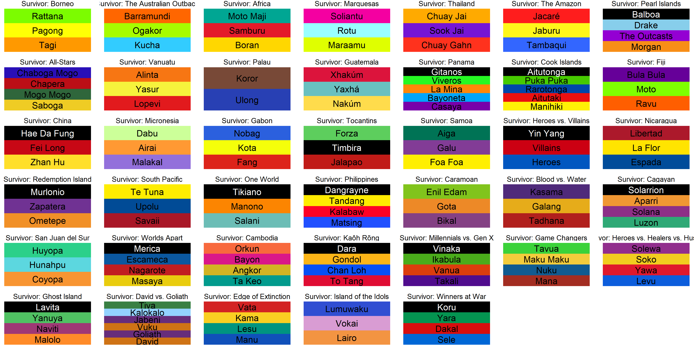

<!-- README.md is generate from README.Rmd. Please edit that file -->

```{r, echo = FALSE}
knitr::opts_chunk$set(
  collapse = TRUE,
  comment = '#>',
  fig.path = 'README-',
  error = TRUE,
  eval = TRUE,
  fig.height = 5
)

suppressPackageStartupMessages(library(tidyverse))
suppressPackageStartupMessages(library(dplyr))
suppressPackageStartupMessages(library(forcats))
suppressPackageStartupMessages(library(survivoR))
suppressPackageStartupMessages(library(paletteer))
```

# survivoR 

596 episodes. 40 season. 1 package!

survivoR is a collection of data sets detailing events across all 40 seasons of the US Survivor, including castaway information, vote history, immunity and reward challenge winners and jury votes.

# Installation

```{r, eval = FALSE}
devtools::install_github("doehm/survivoR")
```


# Dataset overview

## Season summary

A table containing summary details of each season of Survivor, including the winner, runner ups and location. Note this is a nested data frame given there may be 1 or 2 runner ups. The grain is maintained to 1 row per season.

```{r}
season_summary
```

```{r, eval = FALSE}
season_summary %>%
  select(season, viewers_premier, viewers_finale, viewers_reunion, viewers_mean) %>%
  pivot_longer(cols = -season, names_to = "episode", values_to = "viewers") %>%
  mutate(
    episode = to_title_case(str_replace(episode, "viewers_", ""))
  ) %>%
  ggplot(aes(x = season, y = viewers, colour = episode)) +
  geom_line() +
  geom_point(size = 2) +
  theme_minimal() +
  scale_colour_survivor(16) +
  labs(
    title = "Survivor viewers over the 40 seasons",
    x = "Season",
    y = "Viewers (Millions)",
    colour = "Episode"
  )
```


## Castaways

Season and demographic information about each castaway. If demographic information is missing, it likely means that castaway re-entered the game at a later stage.

```{r}
castaways %>% 
  filter(season == 40)
```

## Vote history

Detailed data on the vote history for each tribal council. See the help doc for more detailed description.

```{r}
vh <- vote_history %>% 
  filter(
    season == 40,
    episode == 10
  )
vh
```

```{r}
vh %>% 
  count(vote)
```

## Immunity

A nested tidy data frame of immunity challenge results. Each row is a tribal council. There may be multiple people or tribes that win immunity which can be determined by expanding the data set.

```{r}
immunity %>% 
  filter(season == 40) %>% 
  unnest(c(immunity))
```

## Rewards

A nested data frame of reward challenge results. Each row is a reward challenge. Typically in the merge, if a single person win a reward they are allowed to bring others along with them. The first castaway in the expanded list is likely to be the winner and the susequent players those they brought along with them.

```{r}
rewards %>% 
  filter(season == 40) %>% 
  unnest(c(reward))
```

## Jury votes

History of jury votes. It is more verbose than it needs to be, however having a 0-1 column indicating if a vote was placed or not makes it easier to summarise castaways that received no votes.

```{r}
jury_votes %>% 
  filter(season == 40)
```

```{r}
jury_votes %>% 
  filter(season == 40) %>% 
  group_by(finalist) %>% 
  summarise(votes = sum(vote))
```
## Tribe colours

A data frame that contains the tribe names and colours for each season.

```{r}
tribe_colours
```




# Issues

Given the variable nature of the game of Survivor and changing of the rules, there are bound to be edges cases where the data is not quite right. Please log an issue and I will correct the datasets.

# References

Data was almost entirely sourced from [Wikipedia](https://en.wikipedia.org/wiki/Survivor_(American_TV_series)). Other data, such as the tribe colours, was manually recorded and entered by myself.
