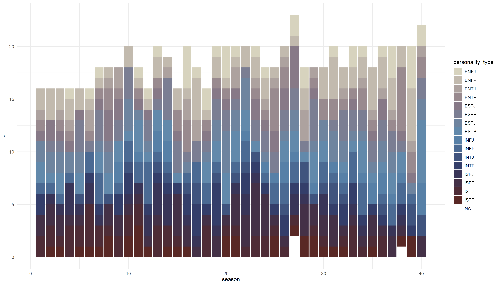
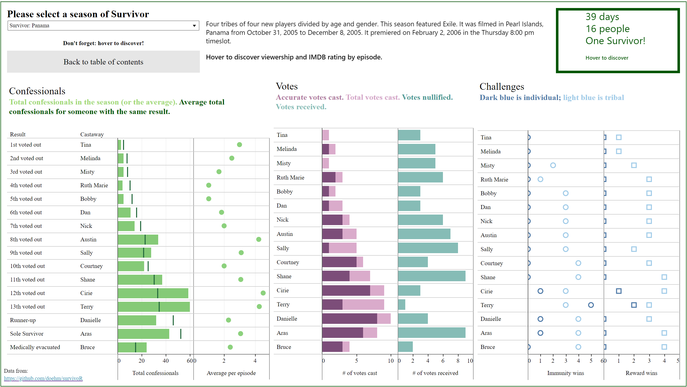

<!-- README.md is generate from README.Rmd. Please edit that file -->

```{r, echo = FALSE}
knitr::opts_chunk$set(
  collapse = TRUE,
  comment = '#>',
  fig.path = 'README-',
  error = TRUE,
  eval = TRUE,
  fig.height = 5
)

suppressPackageStartupMessages(library(tidyverse))
suppressPackageStartupMessages(library(dplyr))
suppressPackageStartupMessages(library(forcats))
suppressPackageStartupMessages(library(survivoR))
suppressPackageStartupMessages(library(paletteer))
suppressPackageStartupMessages(library(glue))

good_pal <<- c("#ffffff", "#f2fbd2", "#c9ecb4", "#93d3ab", "#35b0ab")
bad_pal <<- rev(c("#ef6351", "#f38375", "#f7a399", "#fbc3bc", "#ffe3e0", "white"))

```


# survivoR 

610 episodes. 41 seasons. 1 package!

survivoR is a collection of data sets detailing events across all 41 seasons of the US Survivor, including castaway information, vote history, immunity and reward challenge winners and jury votes.

# Installation

Now on CRAN (v0.9.12).

```{r, eval = FALSE}
install.packages("survivoR")
```

Or install from Git for the latest (`r str_replace(readLines("DESCRIPTION")[4], 'Version: ', 'v')`). I'm constantly improving the data sets and the github version is likely to be slightly improved.

```{r, eval = FALSE}
devtools::install_github("doehm/survivoR")
```

# News

survivoR `r str_replace(readLines("DESCRIPTION")[4], 'Version: ', 'v')`

* Season 42 cast now added
* POC flag on `castaway_details`
* Updated Castaway IDs. Now in the format of USxxxx in preparation for non-US seasons. Original IDs can be extracted using `as.numeric(str_extract(castaway_id, '[:digit:]+'))` in a mutate step.
  
# Australian Survivor: Blood Vs Water

For episode by episode updates [follow me](https://twitter.com/danoehm) on `r gt::html(fontawesome::fa('twitter'))`.

<center><a href='https://gradientdescending.com/survivor/AU/07/vote-circle.png'></a></center>

<center><a href='https://gradientdescending.com/survivor/AU/07/confessionals.html'></a></center>

# Survivor: 42

<center><a href='https://gradientdescending.com/survivor/US/42/infographic.png'></a></center>

<!-- <center><a href='https://gradientdescending.com/survivor/US/42/confessionals.html'><iframe style="border: none; width: 100%; height: 700px;" src="https://gradientdescending.com/survivor/US/42/confessionals.html"></iframe></a></center> -->

<center><a href='https://gradientdescending.com/survivor/US/42/confessionals.html'></a></center>
  
<center>Click to expand</center>

Confessional counts from myself, [Carly Levitz](https://twitter.com/carlylevitz) and [juststrategic](https://twitter.com/justrategic)

# Dataset overview

## Season summary

A table containing summary details of each season of Survivor, including the winner, runner ups and location. 

```{r}
season_summary
```

```{r, eval = FALSE, include = FALSE}
season_summary |>
  select(season, viewers_premier, viewers_finale, viewers_reunion, viewers_mean) |>
  pivot_longer(cols = -season, names_to = "episode", values_to = "viewers") |>
  mutate(
    episode = to_title_case(str_replace(episode, "viewers_", ""))) |>
  ggplot(aes(x = season, y = viewers, colour = episode)) +
  geom_line() +
  geom_point(size = 2) +
  theme_minimal() +
  scale_colour_tribes(16) +
  labs(
    title = "Survivor viewers over the 40 seasons",
    x = "Season",
    y = "Viewers (Millions)",
    colour = "Episode"
  )
```

<!--  -->

## Castaways

This data set contains season and demographic information about each castaway. It is structured to view their results for each season. Castaways that have played in multiple seasons will feature more than once with the age and location representing that point in time. Castaways that re-entered the game will feature more than once in the same season as they technically have more than one boot order e.g. Natalie Anderson - Winners at War.

Each castaway has a unique `castaway_id` which links the individual across all data sets and seasons. It also links to the following ID's found on the `vote_history`, `jury_votes` and `challenges` data sets.

* `vote_id`
* `voted_out_id`
* `finalist_id`
* `winner_id`


```{r}
castaways |> 
  filter(season == 40)
```

### Castaway details

A few castaways have changed their name from season to season or have been referred to by a different name during the season e.g. Amber Mariano; in season 8 Survivor All-Stars there was Rob C and Rob M. That information has been retained here in the `castaways` data set. 

`castaway_details` contains unique information for each castaway. It takes the full name from their most current season and their most verbose short name which is handy for labelling.

It also includes gender, date of birth, occupation, race and ethnicity data. If no source was found to determine a castaways race and ethnicity, the data is kept as missing rather than making an assumption.


```{r}
castaway_details
```


## Vote history

This data frame contains a complete history of votes cast across all seasons of Survivor. This allows you to see who who voted for who at which Tribal Council. It also includes details on who had individual immunity as well as who had their votes nullified by a hidden immunity idol. This details the key events for the season. 

```{r}
vh <- vote_history |> 
  filter(
    season == 40,
    episode == 10
  ) 
vh
```

```{r}
vh |> 
  count(vote)
```

Events in the game such as fire challenges, rock draws, steal-a-vote advantages or countbacks in the early days often mean a vote wasn't placed for an individual. Rather a challenge may be won, lost, no vote cast but attended Tribal Council, etc. These events are recorded in the <code>vote</code> field. I have included a function <code>clean_votes</code> for when only need the votes cast for individuals. If the input data frame has the <code>vote</code> column it can simply be piped.

```{r}
vh |> 
  clean_votes() |> 
  count(vote)
```


## Challenges

The `challenge_results` and `challenge_description` data sets supersede the `challenges` data set.

### Challenge results

A nested tidy data frame of immunity and reward challenge results. The winners and winning tribe of the challenge are found by expanding the `winners` column. For individual immunity challenges the winning tribe is simply `NA`.

```{r}
challenge_results |> 
  filter(season == 40)
```

Typically in the merge if a single person win a reward they are allowed to bring others along with them. This is identified by `outcome_status` column. If it states `Chosen to particpate` it means they were chosen by the winner to particpate in the reward.

The `day` field on this data set represents the day of the tribal council rather than the day of the challenge. This is to more easily associate the reward challenge with the immunity challenge and result of the tribal council. It also helps for joining tables.

The `challenge_id` is the primary key for the `challenge_description` data set. The `challange_id` will change as the data or descriptions change.

### Challenge description

This data set contains descriptive binary fields for each challenge. Challenges can go by different names but where possible recurring challenges are kept consistent. While there are tweaks to the challenges, where the main components of the challenge is consistent, they share the same name. 

The features of each challenge have been determined largely through string searches of key words that describe the challenge. It may not capture the full essence of the challenge but on the whole will provide a good basis for analysis. 
Since the description is simply a short paragraph or sentence it may not flag all appropriate features. If any descriptive features need altering please let me know in the [issues](https://github.com/doehm/survivoR/issues).

Features:

* `puzzle`: If the challenge contains a puzzle element.
* `race`: If the challenge is a race between tribes, teams or individuals.
* `precision`: If the challenge contains a precision element e.g. shooting an arrow, hitting a target, etc.
* `endurance`: If the challenge is an endurance event e.g. last tribe, team, individual standing.
* `strength`: If the challenge is largerly strength based e.g. Shoulder the Load.
* `turn_based`: If the challenge is conducted in a series of rounds until a certain amount of points are scored or there is one player remaining.
* `balance`: If the challenge contains a balancing element.
* `food`: If the challenge contains a food element e.g. the food challenge, biting off chunks of meat.
* `knowledge`: If the challenge contains a knowledge component e.g. Q and A about the location.
* `memory`: If the challenge contains a memory element e.g. memorising a sequence of items.
* `fire`: If the challenge contains an element of fire making / maintaining.
* `water`: If the challenge is held, in part, in the water.

```{r}
challenge_description

challenge_description |> 
  summarise_if(is_logical, sum)
```


## Jury votes

History of jury votes. It is more verbose than it needs to be, however having a 0-1 column indicating if a vote was placed or not makes it easier to summarise castaways that received no votes.

```{r jury votes}
jury_votes |> 
  filter(season == 40)
```

```{r jury votes sum}
jury_votes |> 
  filter(season == 40) |> 
  group_by(finalist) |> 
  summarise(votes = sum(vote))
```


## Hidden Idols

A dataset containing the history of hidden immunity idols including who found them, on what day and which day they were played. The idol number increments for each idol the castaway finds during the game.

```{r}
hidden_idols |> 
  filter(season == 40)
```


## Confessionals

A dataset containing the number of confessionals for each castaway by season and episode. This has been collated from multiple sources. 

```{r}
confessionals |> 
  filter(season == 40) |> 
  group_by(castaway) |> 
  summarise(n_confessionals = sum(confessional_count))
```


## Viewers

A data frame containing the viewer information for every episode across all seasons. It also includes the rating and viewer share information for viewers aged 18 to 49 years of age.

```{r viewers}
viewers |> 
  filter(season == 40)
```


## Tribe colours

This data frame contains the tribe names and colours for each season, including the RGB values. These colours can be joined with the other data frames to customise colours for plots. Another option is to add tribal colours to ggplots with the scale functions. 

```{r tribe colours}
tribe_colours
```


# Scale functions

Included are ggplot2 scale functions of the form <code>scale_fill_survivor()</code> and <code>scale_fill_tribes()</code> to add season and tribe colours to ggplot. The <code>scale_fill_survivor()</code> scales uses a colour palette extracted from the season logo and <code>scale_fill_tribes()</code> scales uses the tribal colours of the specified season as a colour palette. 

All that is required for the 'survivor' palettes is the desired season as input. If not season is provided it will default to season 40.


```{r survivor scales, eval = FALSE}
castaways |> 
  count(season, personality_type) |> 
  ggplot(aes(x = season, y = n, fill = personality_type)) +
  geom_bar(stat = "identity") +
  scale_fill_survivor(40) +
  theme_minimal()
```



Below are the palettes for all seasons.


To use the tribe scales, simply input the season number desired to use those tribe colours. If the fill or colour aesthetic is the tribe name, this needs to be passed to the scale function as <code>scale_fill_tribes(season, tribe = tribe)</code> (for now) where <code>tribe</code> is on the input data frame. If the fill or colour aesthetic is independent from the actual tribe names, like gender for example, <code>tribe</code> does not need to be specified and will simply use the tribe colours as a colour palette, such as the viewers line graph above.

```{r tribe scales, eval = FALSE}
ssn <- 35
labels <- castaways |>
  filter(
    season == ssn,
    str_detect(result, "Sole|unner")
  ) |>
  mutate(label = glue("{castaway} ({original_tribe})")) |>
  select(label, castaway)

jury_votes |>
  filter(season == ssn) |>
  left_join(
    castaways |>
      filter(season == ssn) |>
      select(castaway, original_tribe),
    by = "castaway"
  ) |>
  group_by(finalist, original_tribe) |>
  summarise(votes = sum(vote)) |>
  left_join(labels, by = c("finalist" = "castaway")) |>
  {
    ggplot(., aes(x = label, y = votes, fill = original_tribe)) +
      geom_bar(stat = "identity", width = 0.5) +
      scale_fill_tribes(ssn, tribe = .$original_tribe) +
      theme_minimal() +
      labs(
        x = "Finalist (original tribe)",
        y = "Votes",
        fill = "Original\ntribe",
        title = "Votes received by each finalist"
      )
  }
```

```{r save tribal, echo = FALSE, eval = FALSE}
ggsave("dev/images/votes.png", height = 4, width = 8)
```


# Issues

Given the variable nature of the game of Survivor and changing of the rules, there are bound to be edges cases where the data is not quite right. Before logging an issue please install the git version to see if it has already been corrected. If not, please log an issue and I will correct the datasets.

New features will be added, such as details on exiled castaways across the seasons. If you have a request for specific data let me know in the issues and I'll see what I can do. Also, if you'd like to contribute by adding to existing datasets or contribute a new dataset, please [contact me directly](http://gradientdescending.com/contact/).

# Showcase

## Survivor Dashboard

[**Carly Levitz**](https://twitter.com/carlylevitz) has developed a fantastic [dashboard](https://public.tableau.com/app/profile/carly.levitz/viz/SurvivorCBSData-Acknowledgements/Acknowledgements) showcasing the data and allowing you to drill down into seasons, castaways, voting history and challenges. 

[](https://public.tableau.com/app/profile/carly.levitz/viz/SurvivorCBSData-Acknowledgements/Acknowledgements)

## Data viz 

This looks at the number of immunity idols won and votes received for each winner.

[](https://gradientdescending.com/survivor/torches_png.png)

# Contributors

A big thank you to:

* **Camilla Bendetti** for collating the personality type data for each castaway.
* **Uygar Sozer** for adding the filming start and end dates for each season.
* **Holt Skinner** for creating the castaway ID to map people across seasons and manage name changes.
* **Carly Levitz** for providing 
  * Data corrections across all data sets.
  * Gender, race and ethnicity data.
* **Kosta Psaltis** for sharing the race data for validation

# References

Data was almost entirely sourced from [Wikipedia](https://en.wikipedia.org/wiki/Survivor_(American_TV_series)). Other data, such as the tribe colours, was manually recorded and entered by myself and contributors.

Torch graphic in hex: [Fire Torch Vectors by Vecteezy](https://www.vecteezy.com/free-vector/fire-torch)

