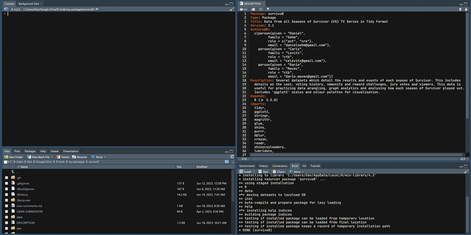

```{r, echo = FALSE, warning=FALSE}
knitr::opts_chunk$set(
  collapse = TRUE,
  comment = '#>',
  fig.path = 'README-',
  error = TRUE,
  eval = TRUE,
  fig.height = 5
)

suppressPackageStartupMessages(library(tidyverse))
suppressPackageStartupMessages(library(dplyr))
suppressPackageStartupMessages(library(forcats))
suppressPackageStartupMessages(library(survivoR))
suppressPackageStartupMessages(library(paletteer))
suppressPackageStartupMessages(library(glue))

good_pal <<- c("#ffffff", "#f2fbd2", "#c9ecb4", "#93d3ab", "#35b0ab")
bad_pal <<- rev(c("#ef6351", "#f38375", "#f7a399", "#fbc3bc", "#ffe3e0", "white"))

max_eps <- viewers |> 
  filter(episode_title != "Reunion") |> 
  nrow()

max_seasons <- season_summary |> 
  nrow()

# in progress seasons
in_prog_eps <- survivoR::castaways |> 
  filter(version_season == "US43") |> 
  pull(episode) |> 
  max(na.rm = TRUE)

n_people <- nrow(castaway_details)

version <- str_replace(readLines("DESCRIPTION")[4], 'Version: ', 'v')
  
```


# survivoR 

`r max_seasons` seasons. `r n_people` people. 1 package!

survivoR is a collection of data sets detailing events across `r max_seasons` seasons of Survivor US, Australia, South Africa, New Zealand and UK. It includes castaway information, vote history, immunity and reward challenge winners, jury votes, advantage details and a lot more.

# Installation

Now on CRAN (v2.3.1) or Git (`r version`).

If Git > CRAN I'd suggest install from Git. We are constantly improving the data sets so the github version is likely to be slightly improved.

```{r, eval = FALSE}
install.packages("survivoR")
```

```{r, eval = FALSE}
devtools::install_github("doehm/survivoR")
```

# News: survivoR 2.3.1

* Adding complete seasons
    * US45
    * UK03
* New data set `auction_details`
* New features on `survivor_auction`
* Refreshed `challenge_description.` Includes:
    * Name
    * Recurring name
    * Description
    * Reward description
    * Challenge characteristics
    * Refreshed chhllenge_id
* Refreshed `challenge_results.` Includes:
    * New `challenge_id` to link with `challenge_description`
    * New `challenge_types` e.g. Team / Individual when there are multiple winning conditions
    * New feature `result_notes` contain info on result winning conditions
* `episode_label` on `episodes` e.g. finale, reunion, etc
* Logicals on `castaways` to filter for
    * `finalists`
    * `winner` 
    * `jury`
* `poc` on castaway details simplified

Additional notes:
* The non-US auction versions are missing alternative item data but will be there in the next release.
* Additional challenge descriptions and characteristics will be included in the next release.

Any corrections needed, please let me know.

# Confessionals

### Confessionals repo

The following link takes you to a repository of complete <a href='http://gradientdescending.com/survivor/tables/confessionals.html'>confessional tables</a>, inlcuding counts and confessional timing for a few seasons.

<a href='http://gradientdescending.com/survivor/tables/confessionals.html'></a>

Confessional counts from [myself](https://twitter.com/danoehm), [Carly Levitz](https://twitter.com/carlylevitz), [Sam](https://twitter.com/survivorfansam), Grace.

### Confessional timing

Included in the package is a confessional timing app to record the length of confessionals while watching the episode. 

To launch the app, first install the package and run,

```{r, eval = FALSE}
library(survivoR)
launch_confessional_app()
```

<a href='https://github.com/doehm/survivoR/tree/master/inst'></a>

To try it out online 👉 [Confessional timing app](https://danieloehm.shinyapps.io/survivorDash/)

More info [here](https://github.com/doehm/survivoR/tree/master/inst).

# Dataset overview

There are 17 data sets included in the package:

1. `advantage_details`
2. `advantage_details`
3. `boot_mapping`
4. `castaway_details`
5. `castaways`
6. `challenge_results`
6. `challenge_description`
7. `confessionals`
8. `jury_votes`
9. `screen_time`
10. `season_palettes`
11. `season_summary`
12. `survivor_auction`
13. `tribe_colours`
14. `tribe_mapping`
15. `episodes`
16. `vote_history`
17. `auction_details`

See the sections below for more details on the key data sets.

<details>
  <summary><strong>Season summary</strong></summary>

## Season summary

A table containing summary details of each season of Survivor, including the winner, runner ups and location. 

```{r}
season_summary
```

</details>

<details>
  <summary><strong>Castaways</strong></summary>

## Castaways

This data set contains season and demographic information about each castaway. It is structured to view their results for each season. Castaways that have played in multiple seasons will feature more than once with the age and location representing that point in time. Castaways that re-entered the game will feature more than once in the same season as they technically have more than one boot order e.g. Natalie Anderson - Winners at War.

Each castaway has a unique `castaway_id` which links the individual across all data sets and seasons. It also links to the following ID's found on the `vote_history`, `jury_votes` and `challenges` data sets.

* `vote_id`
* `voted_out_id`
* `finalist_id`

```{r}
castaways |> 
  filter(season == 45)
```

## Castaway details

A few castaways have changed their name from season to season or have been referred to by a different name during the season e.g. Amber Mariano; in season 8 Survivor All-Stars there was Rob C and Rob M. That information has been retained here in the `castaways` data set. 

`castaway_details` contains unique information for each castaway. It takes the full name from their most current season and their most verbose short name which is handy for labelling.

It also includes gender, date of birth, occupation, race, ethnicity and other data. If no source was found to determine a castaways race and ethnicity, the data is kept as missing rather than making an assumption.

`african_american`, `asian_american`, `latin_american`, `native_american`, `race`, `ethnicity`, and `bipoc` data is complete only for the US. `bipoc` is `TRUE` when any of the `*_american` fields are `TRUE`. These fields have been recorded as per the (Survivor wiki)[https://survivor.fandom.com/wiki/Main_Page]. Other versions have been left blank as the data is not complete and the term 'people of colour' is typically only used in the US.

I have deprecated the old field `poc` in order to be more inclusive and to make using the race/ethnicity fields simpler.

```{r}
castaway_details
```

</details>

<details>
  <summary><strong>Vote history</strong></summary>

## Vote history

This data frame contains a complete history of votes cast across all seasons of Survivor. This allows you to see who who voted for who at which Tribal Council. It also includes details on who had individual immunity as well as who had their votes nullified by a hidden immunity idol. This details the key events for the season. 

There is some information on split votes to help calculate if a player engaged in a split vote but ultimately hit their target. There are events which influence the vote e.g. Extra votes, safety without power, etc. These are recorded here as well.

```{r}
vh <- vote_history |> 
  filter(
    season == 45,
    episode == 9
  ) 
vh
```

```{r}
vh |> 
  count(vote)
```

</details>

<details>
  <summary><strong>Challenges</strong></summary>

## Challenge results

Note: From v1.1 the `challenge_results` dataset has been improved but could break existing code. The old table is maintained at `challenge_results_dep`

There are two tables `challenge_results` and `challenge_description`.

### Challenge results

A tidy data frame of immunity and reward challenge results. The winners and losers of the challenges are found recorded here.

```{r}
challenge_results |> 
  filter(season == 45) |> 
  group_by(castaway) |> 
  summarise(
    won = sum(result == "Won"),
    lost = sum(result == "Lost"),
    total_challenges = n(),
    chosen_for_reward = sum(chosen_for_reward)
  )
```

The `challenge_id` is the primary key for the `challenge_description` data set. The `challange_id` will change as the data or descriptions change. 

## Challenge description

_Note: This data frame is going through a massive revamp. Stay tuned._

This data set contains the name, description, and descriptive features for each challenge where it is known. Challenges can go by different names so have included the unique name and the recurring challenge name. These are taken directly from the [Survivor Wiki](https://survivor.fandom.com/wiki/Category:Recurring_Challenges). Sometimes there can be variations made on the challenge but go but the same name, or the challenge is integrated with a longer obstacle. In these cases the challenge may share the same recurring challenge name but have a different challenge name. Even if they share the same names the description could be different.

The features of each challenge have been determined largely through string searches of key words that describe the challenge. It may not be 100% accurate due to the different and inconsistent descriptions but in most part they will provide a good basis for analysis. 

If any descriptive features need altering please let me know in the [issues](https://github.com/doehm/survivoR/issues).

```{r}
challenge_description

challenge_description |> 
  summarise_if(is_logical, ~sum(.x, na.rm = TRUE)) |> 
  glimpse()
```

See the help manual for more detailed descriptions of the features.

</details>

<details>
  <summary><strong>Jury votes</strong></summary>

## Jury votes

History of jury votes. It is more verbose than it needs to be, however having a 0-1 column indicating if a vote was placed or not makes it easier to summarise castaways that received no votes.

```{r jury votes}
jury_votes |> 
  filter(season == 45)
```

```{r jury votes sum}
jury_votes |> 
  filter(season == 45) |> 
  group_by(finalist) |> 
  summarise(votes = sum(vote))
```

</details>

<details>
  <summary><strong>Advantages</strong></summary>

## Advantage Details

This dataset lists the hidden idols and advantages in the game for all seasons. It details where it was found, if there was a clue to the advantage, location and other advantage conditions. This maps to the `advantage_movement` table.

```{r}
advantage_details |> 
  filter(season == 45)
```

## Advantage Movement

The `advantage_movement` table tracks who found the advantage, who they may have handed it to and who the played it for. Each step is called an event. The `sequence_id` tracks the logical step of the advantage. For example in season 41, JD found an Extra Vote advantage. JD gave it to Shan in good faith who then voted him out keeping the Extra Vote. Shan gave it to Ricard in good faith who eventually gave it back before Shan played it for Naseer. That movement is recorded in this table.

```{r}
advantage_movement |> 
  filter(advantage_id == "USEV4102")
```

</details>

<details>
  <summary><strong>Confessionals</strong></summary>

## Confessionals

A dataset containing the number of confessionals for each castaway by season and episode. There are multiple contributors to this data. Where there are multiple sets of counts for a season the average is taken and added to the package. The aim is to establish consistency in confessional counts in the absence of official sources. Given the subjective nature of the counts and the potential for clerical error no single source is more valid than another. So it is reasonable to average across all sources.

Confessional time exists for a few seasons. This is the total cumulative time for each castaway in seconds. This is a much more accurate indicator of the 'edit'.

```{r}
confessionals |> 
  filter(season == 45) |> 
  group_by(castaway) |> 
  summarise(
    count = sum(confessional_count),
    time = sum(confessional_time)
    )
```

The confessional index is available on this data set. The index is a standardised measure of the number of confessionals the player has received compared to the others. It is stratified by tribe so it measures how many confessionals each player gets proportional to even share within tribe e.g. an index of 1.5 means that player as received 50% more than others in their tribe.

The tribe grouping is important since the tribe that attends tribal council typical get more screen time, which is fair enough. I don't think we should expect even share across everyone in the pre-merge stage of the game.

The index is cumulative with episode, so the players final index is the index in their final episode.

```{r}
confessionals |> 
  filter(season == 45) |> 
  group_by(castaway) |> 
  slice_max(episode) |> 
  arrange(desc(index_time)) |> 
  select(castaway, episode, confessional_count, confessional_time, index_count, index_time)
```


</details>

<details>
  <summary><strong>Screen time</strong></summary>

## Screen time [EXPERIMENTAL]

This dataset contains the estimated screen time for each castaway during an episode. Please note that this is still in the early days of development. There is likely to be misclassifcation and other sources of error. The model will be refined over time.

An individuals' screen time is calculated, at a high-level, via the following process:

1. Frames are sampled from episodes on a 1 second time interval

2. MTCNN detects the human faces within each frame

3. VGGFace2 converts each detected face into a 512d vector space

4. A training set of labelled images (1 for each contestant + 3 for Jeff Probst) is processed in the same way to determine where they sit in the vector space. TODO: This could be made more accurate by increasing the number of training images per contestant.

5. The Euclidean distance is calculated for the faces detected in the frame to each of the contestants in the season (+Jeff). If the minimum distance is greater than 1.2 the face is labelled as "unknown". TODO: Review how robust this distance cutoff truly is - currently based on manual review of Season 42.

6. A multi-class SVM is trained on the training set to label faces. For any face not identified as "unknown", the vector embedding is run into this model and a label is generated.

7. All labelled faces are aggregated together, with an assumption of 1-5 full second of screen time each time a face is seen and factoring in time between detection capping at a max of 5 seconds.


```{r}
screen_time |> 
  filter(version_season == "US45") |> 
  group_by(castaway_id) |> 
  summarise(total_mins = sum(screen_time)/60) |> 
  left_join(
    castaway_details |> 
      select(castaway_id, castaway = short_name),
    by = "castaway_id"
  ) |> 
  arrange(desc(total_mins))
```

Currently it only includes data for season 42. More seasons will be added as they are completed.

</details>

<details>
  <summary><strong>Boot mapping</strong></summary>
  
## Boot mapping

A mapping table to detail who is still alive at each stage of the game. It is useful for easy filtering to say the final \code{n} players. 

```{r}
# filter to season 45 and when there are 6 people left
# 18 people in the season, therefore 12 boots

still_alive <- function(.version, .season, .n_boots) {
  survivoR::boot_mapping |>
    filter(
      version == .version,
      season == .season,
      final_n == 6,
      game_status %in% c("In the game", "Returned")
    )
}

still_alive("US", 45, 6)
```

</details>

<details>
  <summary><strong>Episodes</strong></summary>

## Episodes

Episodes is an episode level table. It contains the episode information such as episode title, air date, length, IMDb rating and the viewer information for every episode across all seasons.

```{r episodes}
episodes |> 
  filter(season == 45)
```

</details>

<details>
  <summary><strong>Survivor Auction</strong></summary>
  
## Survivor Auction

There are 2 data sets, `survivor_acution` and `auction_details`. `survivor_auction` simply shows who attended the auction and `auction_details` holds the details of the auction e.g. who bought what and at what price.

```{r auction}
auction_details |> 
  filter(season == 45)
```

</details>

# Issues

Given the variable nature of the game of Survivor and changing of the rules, there are bound to be edges cases where the data is not quite right. Before logging an issue please install the git version to see if it has already been corrected. If not, please log an issue and I will correct the datasets.

New features will be added, such as details on exiled castaways across the seasons. If you have a request for specific data let me know in the issues and I'll see what I can do. 


# Showcase

## Survivor Dashboard

[**Carly Levitz**](https://twitter.com/carlylevitz) has developed a fantastic [dashboard](https://public.tableau.com/app/profile/carly.levitz/viz/SurvivorCBSData-Acknowledgements/Tableofcontents) showcasing the data and allowing you to drill down into seasons, castaways, voting history and challenges. 

[](https://public.tableau.com/app/profile/carly.levitz/viz/SurvivorCBSData-Acknowledgements/Tableofcontents)

## Data viz 

This looks at the number of immunity idols won and votes received for each winner.

[](https://gradientdescending.com/survivor/torches_png.png)

# Contributors

A big thank you to:

#### Package contributor and maintainers

* [**Carly Levitz**](https://twitter.com/carlylevitz) for ongoing data collection and curation

#### Data contributors

* [**Sam**](https://twitter.com/survivorfansam) for contributing to the confessional counts
* [**Dario Mavec**](https://github.com/dariomavec) for developing the face detection model for estimating total screen time
* **Camilla Bendetti** for collating the personality type data for each castaway.
* **Uygar Sozer** for adding the filming start and end dates for each season.
* **Holt Skinner** for creating the castaway ID to map people across seasons and manage name changes.

# References

Data was sourced from [Wikipedia](https://en.wikipedia.org/wiki/Survivor_(American_TV_series)) and the [Survivor Wiki](https://survivor.fandom.com/wiki/Main_Page). Other data, such as the tribe colours, was manually recorded and entered by myself and contributors.

<!-- Torch graphic in hex: [Fire Torch Vectors by Vecteezy](https://www.vecteezy.com/free-vector/fire-torch) -->
