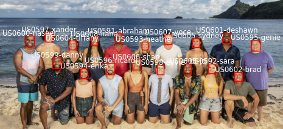

<!-- <link href='https://fonts.googleapis.com/css?family=JetBrains Mono' rel='stylesheet'> -->
<!-- <style type="text/css"> -->
<!-- .sourceCode { -->
<!--     font-family: 'JetBrains Mono Medium'; font-size: 14px; -->
<!-- } -->
<!-- </style> -->
<!-- README.md is generate from README.Rmd. Please edit that file -->


# survivoR 

623 episodes. 42 seasons. 1 package!

survivoR is a collection of data sets detailing events across all 42
seasons of the US Survivor, including castaway information, vote
history, immunity and reward challenge winners and jury votes.

# Installation

Now on CRAN (v1.0.1).

``` r
install.packages("survivoR")
```

Or install from Git for the latest (v1.1.0). We are constantly improving
the data sets and the github version is likely to be slightly improved.

``` r
devtools::install_github("doehm/survivoR")
```

# Changes for v2.0

For v2.0 all Non US seasons of Survivor will be added to the package.
This has the potential to break current analysis scripts. When these
seasons are added there will be multiple season 1, 2, etc. This means
any join or filter on `season` is going either going to error out or
create duplicate rows. It is recommended that all joins and filters on
season are either replaced with `version_season` or include `version`.

You can try it out using `import_non_us_data()`. This imports all
versions currently available. After importing you need to restart R and
load the library again. BIG WARNING! This is still largely in
development and far from complete. Use with caution.

Example:

``` r
import_non_us_data()
#> 
#> Non US data loaded
#> 1. Restart session
#> 2. Run library(survivoR)
```

The data is collated and stored in a list. The following code returns
all season 1’s available in the data set. You can see how joins will
fail when directly joined on state alone.

``` r
castaways |> 
  filter(season == 1) |> 
  distinct(version_season, castaway_id) |> 
  count(version_season)
#> # A tibble: 2 × 2
#>   version_season     n
#>   <chr>          <int>
#> 1 AU01              24
#> 2 US01              16
```

To filter to just the US version we need to add in `version == "US"`

``` r
castaways |> 
  filter(
    version == "US",
    season == 1
    ) |> 
  distinct(version_season, castaway_id) |> 
  count(version_season)
#> # A tibble: 1 × 2
#>   version_season     n
#>   <chr>          <int>
#> 1 US01              16
```

To return to just using the US data by default run `remove_non_us_data`.

``` r
remove_non_us_data()
#> 
#> Non US data removed
#> 1. Restart session
#> 2. Run library(survivoR)
```

Restart R and load the library

# Survivor South Africa: Return of the Outcasts

Dev version v1.1.0 includes episodes 1 to 23.

<a href='http://gradientdescending.com/survivor/tables/confessionals.html'>    Confessional
tables</a>

Confessional counts from [myself](https://twitter.com/danoehm), [Carly
Levitz](https://twitter.com/carlylevitz),
[Sam](https://twitter.com/survivorfansam) and others

# Dataset overview

## Season summary

A table containing summary details of each season of Survivor, including
the winner, runner ups and location.

``` r
season_summary
#> # A tibble: 42 × 22
#>    version versi…¹ seaso…² season locat…³ country tribe…⁴ full_…⁵ winne…⁶ winner
#>    <chr>   <chr>   <chr>    <dbl> <chr>   <chr>   <chr>   <chr>   <chr>   <chr> 
#>  1 US      US01    Surviv…      1 Pulau … Malays… Two tr… Richar… US0016  Richa…
#>  2 US      US02    Surviv…      2 Herber… Austra… Two tr… Tina W… US0032  Tina  
#>  3 US      US03    Surviv…      3 Shaba … Kenya   Two tr… Ethan … US0048  Ethan 
#>  4 US      US04    Surviv…      4 Nuku H… Polyne… Two tr… Vecepi… US0064  Vecep…
#>  5 US      US05    Surviv…      5 Ko Tar… Thaila… Two tr… Brian … US0080  Brian 
#>  6 US      US06    Surviv…      6 Rio Ne… Brazil  Two tr… Jenna … US0096  Jenna 
#>  7 US      US07    Surviv…      7 Pearl … Panama  Two tr… Sandra… US0112  Sandra
#>  8 US      US08    Surviv…      8 Pearl … Panama  Three … Amber … US0027  Amber 
#>  9 US      US09    Surviv…      9 Efate,… Vanuatu Two tr… Chris … US0130  Chris 
#> 10 US      US10    Surviv…     10 Koror,… Palau   A scho… Tom We… US0150  Tom   
#> # … with 32 more rows, 12 more variables: runner_ups <chr>, final_vote <chr>,
#> #   timeslot <chr>, premiered <date>, ended <date>, filming_started <date>,
#> #   filming_ended <date>, viewers_premier <dbl>, viewers_finale <dbl>,
#> #   viewers_reunion <dbl>, viewers_mean <dbl>, rank <dbl>, and abbreviated
#> #   variable names ¹​version_season, ²​season_name, ³​location, ⁴​tribe_setup,
#> #   ⁵​full_name, ⁶​winner_id
```

<!--  -->

## Castaways

This data set contains season and demographic information about each
castaway. It is structured to view their results for each season.
Castaways that have played in multiple seasons will feature more than
once with the age and location representing that point in time.
Castaways that re-entered the game will feature more than once in the
same season as they technically have more than one boot order
e.g. Natalie Anderson - Winners at War.

Each castaway has a unique `castaway_id` which links the individual
across all data sets and seasons. It also links to the following ID’s
found on the `vote_history`, `jury_votes` and `challenges` data sets.

-   `vote_id`
-   `voted_out_id`
-   `finalist_id`
-   `winner_id`

``` r
castaways |> 
  filter(season == 41)
#> # A tibble: 18 × 16
#>    version version_se…¹ seaso…² season full_…³ casta…⁴ casta…⁵   age city  state
#>    <chr>   <chr>        <chr>    <dbl> <chr>   <chr>   <chr>   <dbl> <chr> <chr>
#>  1 US      US41         Surviv…     41 Erika … US0594  Erika      32 Toro… Onta…
#>  2 US      US41         Surviv…     41 Deshaw… US0601  Deshawn    26 Miami Flor…
#>  3 US      US41         Surviv…     41 Xander… US0597  Xander     20 Chic… Illi…
#>  4 US      US41         Surviv…     41 Heathe… US0593  Heather    52 Char… Sout…
#>  5 US      US41         Surviv…     41 Ricard… US0596  Ricard     31 Sedr… Wash…
#>  6 US      US41         Surviv…     41 Danny … US0599  Danny      33 Fris… Texas
#>  7 US      US41         Surviv…     41 Liana … US0608  Liana      20 Wash… D.C. 
#>  8 US      US41         Surviv…     41 Shante… US0606  Shan       34 Wash… D.C. 
#>  9 US      US41         Surviv…     41 Evvie … US0598  Evvie      28 Arli… Mass…
#> 10 US      US41         Surviv…     41 Naseer… US0600  Naseer     37 Morg… Cali…
#> 11 US      US41         Surviv…     41 Tiffan… US0604  Tiffany    47 Plai… New …
#> 12 US      US41         Surviv…     41 Sydney… US0605  Sydney     26 Broo… New …
#> 13 US      US41         Surviv…     41 Genie … US0595  Genie      46 Port… Oreg…
#> 14 US      US41         Surviv…     41 Jairus… US0603  JD         20 Okla… Okla…
#> 15 US      US41         Surviv…     41 Brad R… US0602  Brad       50 Shaw… Wyom…
#> 16 US      US41         Surviv…     41 David … US0607  Voce       35 Chic… Illi…
#> 17 US      US41         Surviv…     41 Sara W… US0592  Sara       24 Bost… Mass…
#> 18 US      US41         Surviv…     41 Eric A… US0591  Abraham    51 San … Texas
#> # … with 6 more variables: episode <dbl>, day <dbl>, order <dbl>, result <chr>,
#> #   jury_status <chr>, original_tribe <chr>, and abbreviated variable names
#> #   ¹​version_season, ²​season_name, ³​full_name, ⁴​castaway_id, ⁵​castaway
```

### Castaway details

A few castaways have changed their name from season to season or have
been referred to by a different name during the season e.g. Amber
Mariano; in season 8 Survivor All-Stars there was Rob C and Rob M. That
information has been retained here in the `castaways` data set.

`castaway_details` contains unique information for each castaway. It
takes the full name from their most current season and their most
verbose short name which is handy for labelling.

It also includes gender, date of birth, occupation, race and ethnicity
data. If no source was found to determine a castaways race and
ethnicity, the data is kept as missing rather than making an assumption.

``` r
castaway_details
#> # A tibble: 626 × 11
#>    castaway_id full_n…¹ short…² date_of_…³ date_of_…⁴ gender race  ethni…⁵ poc  
#>    <chr>       <chr>    <chr>   <date>     <date>     <chr>  <chr> <chr>   <chr>
#>  1 US0001      Sonja C… Sonja   1937-01-28 NA         Female <NA>  <NA>    White
#>  2 US0002      B.B. An… B.B.    1936-01-18 2013-10-29 Male   <NA>  <NA>    White
#>  3 US0003      Stacey … Stacey  1972-08-11 NA         Female <NA>  <NA>    White
#>  4 US0004      Ramona … Ramona  1971-01-20 NA         Female Black <NA>    POC  
#>  5 US0005      Dirk Be… Dirk    1976-06-15 NA         Male   <NA>  <NA>    White
#>  6 US0006      Joel Kl… Joel    1972-04-13 NA         Male   <NA>  <NA>    White
#>  7 US0007      Gretche… Gretch… 1962-02-07 NA         Female <NA>  <NA>    White
#>  8 US0008      Greg Bu… Greg    1975-12-31 NA         Male   <NA>  <NA>    White
#>  9 US0009      Jenna L… Jenna … 1977-07-16 NA         Female <NA>  <NA>    White
#> 10 US0010      Gervase… Gervase 1969-11-02 NA         Male   Black <NA>    POC  
#> # … with 616 more rows, 2 more variables: occupation <chr>,
#> #   personality_type <chr>, and abbreviated variable names ¹​full_name,
#> #   ²​short_name, ³​date_of_birth, ⁴​date_of_death, ⁵​ethnicity
```

## Vote history

This data frame contains a complete history of votes cast across all
seasons of Survivor. This allows you to see who who voted for who at
which Tribal Council. It also includes details on who had individual
immunity as well as who had their votes nullified by a hidden immunity
idol. This details the key events for the season.

``` r
vh <- vote_history |> 
  filter(
    season == 41,
    episode == 9
  ) 
vh
#> # A tibble: 17 × 21
#>    version version_…¹ seaso…² season episode   day tribe…³ tribe casta…⁴ immun…⁵
#>    <chr>   <chr>      <chr>    <dbl>   <dbl> <dbl> <chr>   <chr> <chr>   <chr>  
#>  1 US      US41       Surviv…     41       9    17 Merged  Via … Heather <NA>   
#>  2 US      US41       Surviv…     41       9    17 Merged  Via … Erika   Indivi…
#>  3 US      US41       Surviv…     41       9    17 Merged  Via … Ricard  <NA>   
#>  4 US      US41       Surviv…     41       9    17 Merged  Via … Naseer  <NA>   
#>  5 US      US41       Surviv…     41       9    17 Merged  Via … Shan    <NA>   
#>  6 US      US41       Surviv…     41       9    17 Merged  Via … Shan    <NA>   
#>  7 US      US41       Surviv…     41       9    17 Merged  Via … Heather <NA>   
#>  8 US      US41       Surviv…     41       9    17 Merged  Via … Erika   Indivi…
#>  9 US      US41       Surviv…     41       9    17 Merged  Via … Ricard  <NA>   
#> 10 US      US41       Surviv…     41       9    17 Merged  Via … Naseer  <NA>   
#> 11 US      US41       Surviv…     41       9    17 Merged  Via … Shan    <NA>   
#> 12 US      US41       Surviv…     41       9    17 Merged  Via … Shan    <NA>   
#> 13 US      US41       Surviv…     41       9    17 Merged  Via … Xander  Indivi…
#> 14 US      US41       Surviv…     41       9    17 Merged  Via … Evvie   <NA>   
#> 15 US      US41       Surviv…     41       9    17 Merged  Via … Danny   <NA>   
#> 16 US      US41       Surviv…     41       9    17 Merged  Via … Deshawn <NA>   
#> 17 US      US41       Surviv…     41       9    17 Merged  Via … Liana   <NA>   
#> # … with 11 more variables: vote <chr>, vote_event <chr>, split_vote <chr>,
#> #   nullified <lgl>, tie <lgl>, voted_out <chr>, order <dbl>, vote_order <dbl>,
#> #   castaway_id <chr>, vote_id <chr>, voted_out_id <chr>, and abbreviated
#> #   variable names ¹​version_season, ²​season_name, ³​tribe_status, ⁴​castaway,
#> #   ⁵​immunity
```

``` r
vh |> 
  count(vote)
#> # A tibble: 5 × 2
#>   vote        n
#>   <chr>   <int>
#> 1 Evvie       3
#> 2 Heather     2
#> 3 Liana       2
#> 4 Naseer      8
#> 5 <NA>        2
```

## Challenges

Note: From v1.1 the `challenge_results` dataset has been improved but
could break existing code. The old table is maintained at
`challenge_results_dep`

There are two tables `challenge_results` and `challenge_description`.

### Challenge results

A tidy data frame of immunity and reward challenge results. The winners
and losers of the challenges are found recorded here.

``` r
challenge_results |> 
  filter(season == 42) |> 
  group_by(castaway) |> 
  summarise(
    won = sum(result == "Won"),
    Lost = sum(result == "Lost"),
    total_challenges = n(),
    chose_for_reward = sum(chosen_for_reward)
  )
#> # A tibble: 18 × 5
#>    castaway   won  Lost total_challenges chose_for_reward
#>    <chr>    <int> <int>            <int>            <int>
#>  1 Chanelle     4     7               11                0
#>  2 Daniel       3     4                7                0
#>  3 Drea         5    11               16                0
#>  4 Hai          5    10               15                0
#>  5 Jackson      0     1                1                0
#>  6 Jenny        2     2                4                0
#>  7 Jonathan    10    10               20                1
#>  8 Lindsay      9    10               19                1
#>  9 Lydia        4     5                9                0
#> 10 Marya        1     2                3                0
#> 11 Maryanne     7    13               20                1
#> 12 Mike         5    15               20                2
#> 13 Omar         6    12               18                1
#> 14 Rocksroy     5     8               13                0
#> 15 Romeo        5    15               20                1
#> 16 Swati        3     3                6                0
#> 17 Tori         9     4               13                0
#> 18 Zach         1     1                2                0
```

The `challenge_id` is the primary key for the `challenge_description`
data set. The `challange_id` will change as the data or descriptions
change.

### Challenge description

This data set contains descriptive binary fields for each challenge.
Challenges can go by different names but where possible recurring
challenges are kept consistent. While there are tweaks to the
challenges, where the main components of the challenge is consistent,
they share the same name.

The features of each challenge have been determined largely through
string searches of key words that describe the challenge. It may not
capture the full essence of the challenge but on the whole will provide
a good basis for analysis. Since the description is simply a short
paragraph or sentence it may not flag all appropriate features. If any
descriptive features need altering please let me know in the
[issues](https://github.com/doehm/survivoR/issues).

Features:

-   `puzzle`: If the challenge contains a puzzle element.
-   `race`: If the challenge is a race between tribes, teams or
    individuals.
-   `precision`: If the challenge contains a precision element
    e.g. shooting an arrow, hitting a target, etc.
-   `endurance`: If the challenge is an endurance event e.g. last tribe,
    team, individual standing.
-   `strength`: If the challenge is largerly strength based
    e.g. Shoulder the Load.
-   `turn_based`: If the challenge is conducted in a series of rounds
    until a certain amount of points are scored or there is one player
    remaining.
-   `balance`: If the challenge contains a balancing element.
-   `food`: If the challenge contains a food element e.g. the food
    challenge, biting off chunks of meat.
-   `knowledge`: If the challenge contains a knowledge component e.g. Q
    and A about the location.
-   `memory`: If the challenge contains a memory element e.g. memorising
    a sequence of items.
-   `fire`: If the challenge contains an element of fire making /
    maintaining.
-   `water`: If the challenge is held, in part, in the water.

``` r
challenge_description
#> # A tibble: 886 × 14
#>    challeng…¹ chall…² puzzle race  preci…³ endur…⁴ stren…⁵ turn_…⁶ balance food 
#>    <chr>      <chr>   <lgl>  <lgl> <lgl>   <lgl>   <lgl>   <lgl>   <lgl>   <lgl>
#>  1 CC0053     Barrel… FALSE  TRUE  TRUE    FALSE   FALSE   FALSE   FALSE   FALSE
#>  2 CC0079     Blue L… TRUE   TRUE  TRUE    FALSE   FALSE   FALSE   FALSE   FALSE
#>  3 CC0114     By the… FALSE  TRUE  FALSE   FALSE   FALSE   FALSE   TRUE    FALSE
#>  4 CC0138     Choose… FALSE  TRUE  TRUE    FALSE   FALSE   TRUE    FALSE   FALSE
#>  5 CC0232     Flashb… FALSE  FALSE FALSE   TRUE    FALSE   FALSE   FALSE   FALSE
#>  6 CC0305     Home S… TRUE   TRUE  TRUE    FALSE   FALSE   FALSE   TRUE    FALSE
#>  7 CC0334     Kenny … TRUE   TRUE  TRUE    FALSE   FALSE   FALSE   FALSE   FALSE
#>  8 CC0358     Log Jam FALSE  TRUE  FALSE   TRUE    FALSE   TRUE    FALSE   FALSE
#>  9 CC0371     Maroon… FALSE  TRUE  FALSE   FALSE   FALSE   TRUE    FALSE   FALSE
#> 10 CC0408     O-Blac… FALSE  TRUE  TRUE    FALSE   FALSE   FALSE   FALSE   FALSE
#> # … with 876 more rows, 4 more variables: knowledge <lgl>, memory <lgl>,
#> #   fire <lgl>, water <lgl>, and abbreviated variable names ¹​challenge_id,
#> #   ²​challenge_name, ³​precision, ⁴​endurance, ⁵​strength, ⁶​turn_based

challenge_description |> 
  summarise_if(is_logical, sum)
#> # A tibble: 1 × 12
#>   puzzle  race precision endurance strength turn_…¹ balance  food knowl…² memory
#>    <int> <int>     <int>     <int>    <int>   <int>   <int> <int>   <int>  <int>
#> 1    238   721       184       115       50     132     143    23      55     21
#> # … with 2 more variables: fire <int>, water <int>, and abbreviated variable
#> #   names ¹​turn_based, ²​knowledge
```

## Jury votes

History of jury votes. It is more verbose than it needs to be, however
having a 0-1 column indicating if a vote was placed or not makes it
easier to summarise castaways that received no votes.

``` r
jury_votes |> 
  filter(season == 41)
#> # A tibble: 24 × 9
#>    version version_season season_…¹ season casta…² final…³  vote casta…⁴ final…⁵
#>    <chr>   <chr>          <chr>      <dbl> <chr>   <chr>   <dbl> <chr>   <chr>  
#>  1 US      US41           Survivor…     41 Heather Deshawn     0 US0593  US0601 
#>  2 US      US41           Survivor…     41 Ricard  Deshawn     0 US0596  US0601 
#>  3 US      US41           Survivor…     41 Danny   Deshawn     1 US0599  US0601 
#>  4 US      US41           Survivor…     41 Liana   Deshawn     0 US0608  US0601 
#>  5 US      US41           Survivor…     41 Shan    Deshawn     0 US0606  US0601 
#>  6 US      US41           Survivor…     41 Evvie   Deshawn     0 US0598  US0601 
#>  7 US      US41           Survivor…     41 Naseer  Deshawn     0 US0600  US0601 
#>  8 US      US41           Survivor…     41 Tiffany Deshawn     0 US0604  US0601 
#>  9 US      US41           Survivor…     41 Heather Erika       1 US0593  US0594 
#> 10 US      US41           Survivor…     41 Ricard  Erika       1 US0596  US0594 
#> # … with 14 more rows, and abbreviated variable names ¹​season_name, ²​castaway,
#> #   ³​finalist, ⁴​castaway_id, ⁵​finalist_id
```

``` r
jury_votes |> 
  filter(season == 41) |> 
  group_by(finalist) |> 
  summarise(votes = sum(vote))
#> # A tibble: 3 × 2
#>   finalist votes
#>   <chr>    <dbl>
#> 1 Deshawn      1
#> 2 Erika        7
#> 3 Xander       0
```

## Advantages

### Advantage Details

This dataset lists the hidden idols and advantages in the game for all
seasons. It details where it was found, if there was a clue to the
advantage, location and other advantage conditions. This maps to the
`advantage_movement` table.

``` r
advantage_details |> 
  filter(season == 41)
#> # A tibble: 9 × 9
#>   version version_season season…¹ season advan…² advan…³ clue_…⁴ locat…⁵ condi…⁶
#>   <chr>   <chr>          <chr>     <dbl> <chr>   <chr>   <chr>   <chr>   <chr>  
#> 1 US      US41           Survivo…     41 USEV41… Extra … No clu… Shipwh… Valid …
#> 2 US      US41           Survivo…     41 USEV41… Extra … No clu… Shipwh… Valid …
#> 3 US      US41           Survivo…     41 USEV41… Extra … No clu… Shipwh… Valid …
#> 4 US      US41           Survivo…     41 USHI41… Hidden… Found … Found … Beware…
#> 5 US      US41           Survivo…     41 USHI41… Hidden… Found … Found … Beware…
#> 6 US      US41           Survivo…     41 USHI41… Hidden… Found … Found … Beware…
#> 7 US      US41           Survivo…     41 USHI41… Hidden… Found … Found … Beware…
#> 8 US      US41           Survivo…     41 USKP41… Knowle… No clu… Found … <NA>   
#> 9 US      US41           Survivo…     41 USVS41… Steal … No clu… Shipwh… Valid …
#> # … with abbreviated variable names ¹​season_name, ²​advantage_id,
#> #   ³​advantage_type, ⁴​clue_details, ⁵​location_found, ⁶​conditions
```

### Advantage Movement

The `advantage_movement` table tracks who found the advantage, who they
may have handed it to and who the played it for. Each step is called an
event. The `sequence_id` tracks the logical step of the advantage. For
example in season 41, JD found an Extra Vote advantage. JD gave it to
Shan in good faith who then voted him out keeping the Extra Vote. Shan
gave it to Ricard in good faith who eventually gave it back before Shan
played it for Naseer. That movement is recorded in this table.

``` r
advantage_movement |> 
  filter(advantage_id == "USEV4102")
#> # A tibble: 5 × 15
#>   version version…¹ seaso…² season casta…³ casta…⁴ advan…⁵ seque…⁶   day episode
#>   <chr>   <chr>     <chr>    <dbl> <chr>   <chr>   <chr>   <chr>   <dbl>   <dbl>
#> 1 US      US41      Surviv…     41 JD      US0603  USEV41… 1           2       1
#> 2 US      US41      Surviv…     41 Shan    US0606  USEV41… 2           9       4
#> 3 US      US41      Surviv…     41 Ricard  US0596  USEV41… 3           9       4
#> 4 US      US41      Surviv…     41 Shan    US0606  USEV41… 4          11       5
#> 5 US      US41      Surviv…     41 Shan    US0606  USEV41… 5          17       9
#> # … with 5 more variables: event <chr>, played_for <chr>, played_for_id <chr>,
#> #   success <chr>, votes_nullified <dbl>, and abbreviated variable names
#> #   ¹​version_season, ²​season_name, ³​castaway, ⁴​castaway_id, ⁵​advantage_id,
#> #   ⁶​sequence_id
```

## Confessionals

A dataset containing the number of confessionals for each castaway by
season and episode. The data has been counted by contributors of the
survivoR R package and consolidated with external sources. The aim is to
establish consistency in confessional counts in the absence of official
sources. Given the subjective nature of the counts and the potential for
clerical error no single source is more valid than another. Therefore,
it is reasonable to average across all sources.

``` r
confessionals |> 
  filter(season == 41) |> 
  group_by(castaway) |> 
  summarise(n_confessionals = sum(confessional_count))
#> # A tibble: 18 × 2
#>    castaway n_confessionals
#>    <chr>              <dbl>
#>  1 Abraham                2
#>  2 Brad                  14
#>  3 Danny                 29
#>  4 Deshawn               56
#>  5 Erika                 39
#>  6 Evvie                 35
#>  7 Genie                 11
#>  8 Heather               13
#>  9 JD                    22
#> 10 Liana                 34
#> 11 Naseer                11
#> 12 Ricard                36
#> 13 Sara                   4
#> 14 Shan                  51
#> 15 Sydney                15
#> 16 Tiffany               25
#> 17 Voce                   6
#> 18 Xander                56
```

## Screen time

This dataset contains the estimated screen time for each castaway during
an episode. An individuals’ screen time is calculated, at a high-level,
via the following process:

1.  Frames are sampled from episodes on a 1 second time interval

2.  MTCNN detects the human faces within each frame

3.  VGGFace2 converts each detected face into a 512d vector space

4.  A training set of labelled images (1 for each contestant + 3 for
    Jeff Probst) is processed in the same way to determine where they
    sit in the vector space. TODO: This could be made more accurate by
    increasing the number of training images per contestant.

5.  The Euclidean distance is calculated for the faces detected in the
    frame to each of the contestants in the season (+Jeff). If the
    minimum distance is greater than 1.2 the face is labelled as
    “unknown”. TODO: Review how robust this distance cutoff truly is -
    currently based on manual review of Season 42.

6.  A multi-class SVM is trained on the training set to label faces. For
    any face not identified as “unknown”, the vector embedding is run
    into this model and a label is generated.

7.  All labelled faces are aggregated together, with an assumption of 1
    full second of screen time each time a face is seen.



``` r
screen_time |> 
  filter(version_season == "US42") |> 
  group_by(castaway_id) |> 
  summarise(total_mins = sum(screen_time)/60) |> 
  left_join(
    castaway_details |> 
      select(castaway_id, castaway = short_name),
    by = "castaway_id"
  ) |> 
  arrange(desc(total_mins))
#> # A tibble: 20 × 3
#>    castaway_id total_mins castaway
#>    <chr>            <dbl> <chr>   
#>  1 unknown         118.   <NA>    
#>  2 US0619           67.1  Maryanne
#>  3 host             60.1  <NA>    
#>  4 US0622           55.0  Rocksroy
#>  5 US0623           48.5  Romeo   
#>  6 US0615           47.2  Jonathan
#>  7 US0616           46.2  Lindsay 
#>  8 US0621           41.6  Omar    
#>  9 US0620           41.6  Mike    
#> 10 US0612           38.6  Hai     
#> 11 US0611           34.6  Drea    
#> 12 US0617           32.6  Lydia   
#> 13 US0625           25.9  Tori    
#> 14 US0614           18.1  Jenny   
#> 15 US0624           16.1  Swati   
#> 16 US0610           15.8  Daniel  
#> 17 US0609           15.0  Chanelle
#> 18 US0613           13.6  Jackson 
#> 19 US0626            5.42 Zach    
#> 20 US0618            5.33 Marya
```

Currently it only includes data for season 42. More seasons will be
added as they are completed.

## Tribe mapping

A mapping for castaways to tribes for each day (day being the day of the
tribal council). This is useful for observing who is on what tribe
throughout the game. Each season by day holds a complete list of
castaways still in the game and which tribe they are on. Moving through
each day you can observe the changes in the tribe. For example the first
day (usual day 2) has all castaways mapped to their original tribe. The
next day has the same minus the castaway just voted out. This is useful
for observing the changes in tribe make either due to castaways being
voted off the island, tribe swaps, who is on Redemption Island and Edge
of Extinction.

``` r
tribe_mapping |> 
  filter(season == 41)
#> # A tibble: 154 × 10
#>    version version_…¹ seaso…² season episode   day casta…³ casta…⁴ tribe tribe…⁵
#>    <chr>   <chr>      <chr>    <dbl>   <dbl> <dbl> <chr>   <chr>   <chr> <chr>  
#>  1 US      US41       Surviv…     41       1     3 US0591  Abraham Yase  Origin…
#>  2 US      US41       Surviv…     41       1     3 US0592  Sara    Ua    Origin…
#>  3 US      US41       Surviv…     41       1     3 US0593  Heather Luvu  Origin…
#>  4 US      US41       Surviv…     41       1     3 US0594  Erika   Luvu  Origin…
#>  5 US      US41       Surviv…     41       1     3 US0595  Genie   Ua    Origin…
#>  6 US      US41       Surviv…     41       1     3 US0596  Ricard  Ua    Origin…
#>  7 US      US41       Surviv…     41       1     3 US0597  Xander  Yase  Origin…
#>  8 US      US41       Surviv…     41       1     3 US0598  Evvie   Yase  Origin…
#>  9 US      US41       Surviv…     41       1     3 US0599  Danny   Luvu  Origin…
#> 10 US      US41       Surviv…     41       1     3 US0600  Naseer  Luvu  Origin…
#> # … with 144 more rows, and abbreviated variable names ¹​version_season,
#> #   ²​season_name, ³​castaway_id, ⁴​castaway, ⁵​tribe_status
```

## Boot Mapping

A mapping table for easily filtering to the set of castaways that are
still in the game after a specified number of boots. How this differs
from the tribe mapping is that rather than being focused on an episode,
it is focused on the boot which is often more useful. This table can be
used to calculate how many people participated in certain challenges
once mapped to `challenge_results`.

When someone quits the game or is medically evacuated it is considered a
boot. This table tracks multiple boots per episode.

``` r
# filter to season 41 and when there are 6 people left
# 18 people in the season, therefore 12 boots

boot_mapping |> 
  filter(
    season == 41,
    order == 12
    )
#> # A tibble: 6 × 11
#>   version version_s…¹ seaso…² season episode order casta…³ casta…⁴ tribe tribe…⁵
#>   <chr>   <chr>       <chr>    <dbl>   <dbl> <dbl> <chr>   <chr>   <chr> <chr>  
#> 1 US      US41        Surviv…     41      12    12 Heather US0593  Via … Merged 
#> 2 US      US41        Surviv…     41      12    12 Erika   US0594  Via … Merged 
#> 3 US      US41        Surviv…     41      12    12 Ricard  US0596  Via … Merged 
#> 4 US      US41        Surviv…     41      12    12 Xander  US0597  Via … Merged 
#> 5 US      US41        Surviv…     41      12    12 Danny   US0599  Via … Merged 
#> 6 US      US41        Surviv…     41      12    12 Deshawn US0601  Via … Merged 
#> # … with 1 more variable: game_status <chr>, and abbreviated variable names
#> #   ¹​version_season, ²​season_name, ³​castaway, ⁴​castaway_id, ⁵​tribe_status
```

## Viewers

A data frame containing the viewer information for every episode across
all seasons. It also includes the rating and viewer share information
for viewers aged 18 to 49 years of age.

``` r
viewers |> 
  filter(season == 41)
#> # A tibble: 14 × 12
#> # Groups:   version [1]
#>    version version_s…¹ seaso…² season episo…³ episode episo…⁴ episode_…⁵ viewers
#>    <chr>   <chr>       <chr>    <dbl>   <int>   <dbl> <chr>   <date>       <dbl>
#>  1 US      US41        Surviv…     41     597       1 A New … 2021-09-22    6.25
#>  2 US      US41        Surviv…     41     598       2 Juggli… 2021-09-29    5.9 
#>  3 US      US41        Surviv…     41     599       3 My Mil… 2021-10-06    5.79
#>  4 US      US41        Surviv…     41     600       4 They H… 2021-10-13    5.68
#>  5 US      US41        Surviv…     41     601       5 The St… 2021-10-20    5.62
#>  6 US      US41        Surviv…     41     602       6 Ready … 2021-10-27    5.32
#>  7 US      US41        Surviv…     41     603       7 There'… 2021-11-03    5.47
#>  8 US      US41        Surviv…     41     604       8 Betray… 2021-11-10    5.56
#>  9 US      US41        Surviv…     41     605       9 Who's … 2021-11-17    5.76
#> 10 US      US41        Surviv…     41     606      10 Baby W… 2021-11-24    5.54
#> 11 US      US41        Surviv…     41     607      11 Do or … 2021-12-01    5.63
#> 12 US      US41        Surviv…     41     608      12 Truth … 2021-12-08    5.7 
#> 13 US      US41        Surviv…     41     609      13 One Th… 2021-12-15    5.82
#> 14 US      US41        Surviv…     41     610      14 Surviv… 2021-12-15    4   
#> # … with 3 more variables: rating_18_49 <dbl>, share_18_49 <dbl>,
#> #   imdb_rating <dbl>, and abbreviated variable names ¹​version_season,
#> #   ²​season_name, ³​episode_number_overall, ⁴​episode_title, ⁵​episode_date
```

## Tribe colours

This data frame contains the tribe names and colours for each season,
including the RGB values. These colours can be joined with the other
data frames to customise colours for plots. Another option is to add
tribal colours to ggplots with the scale functions.

``` r
tribe_colours
#> # A tibble: 154 × 7
#>    version version_season season_name               season tribe tribe…¹ tribe…²
#>    <chr>   <chr>          <chr>                      <dbl> <chr> <chr>   <chr>  
#>  1 US      US01           Survivor: Borneo               1 Ratt… #7CFC00 Merged 
#>  2 US      US01           Survivor: Borneo               1 Pago… #FFFF05 Origin…
#>  3 US      US01           Survivor: Borneo               1 Tagi  #FF9900 Origin…
#>  4 US      US02           Survivor: The Australian…      2 Barr… #FF6600 Merged 
#>  5 US      US02           Survivor: The Australian…      2 Kucha #32CCFF Origin…
#>  6 US      US02           Survivor: The Australian…      2 Ogak… #A7FC00 Origin…
#>  7 US      US03           Survivor: Africa               3 Moto… #00A693 Merged 
#>  8 US      US03           Survivor: Africa               3 Boran #FFD700 Origin…
#>  9 US      US03           Survivor: Africa               3 Samb… #E41A2A Origin…
#> 10 US      US04           Survivor: Marquesas            4 Soli… #F400A1 Merged 
#> # … with 144 more rows, and abbreviated variable names ¹​tribe_colour,
#> #   ²​tribe_status
```


# Scale functions

Included are ggplot2 scale functions of the form
<code>scale_fill_survivor()</code> and <code>scale_fill_tribes()</code>
to add season and tribe colours to ggplot. The
<code>scale_fill_survivor()</code> scales uses a colour palette
extracted from the season logo and <code>scale_fill_tribes()</code>
scales uses the tribal colours of the specified season as a colour
palette.

All that is required for the ‘survivor’ palettes is the desired season
as input. If not season is provided it will default to season 40.


``` r
castaways |> 
  distinct(season, castaway_id) |> 
  left_join(
    castaway_details |> 
      select(castaway_id, personality_type),
    by = "castaway_id"
  ) |> 
  ggplot(aes(x = season, y = n, fill = personality_type)) +
  geom_bar(stat = "identity") +
  scale_fill_survivor(40) +
  theme_minimal()
```


Below are the palettes for all seasons.


To use the tribe scales, simply input the season number desired to use
those tribe colours. If the fill or colour aesthetic is the tribe name,
this needs to be passed to the scale function as
<code>scale_fill_tribes(season, tribe = tribe)</code> (for now) where
<code>tribe</code> is on the input data frame. If the fill or colour
aesthetic is independent from the actual tribe names, like gender for
example, <code>tribe</code> does not need to be specified and will
simply use the tribe colours as a colour palette, such as the viewers
line graph above.

``` r
ssn <- 35
labels <- castaways |>
  filter(
    season == ssn,
    str_detect(result, "Sole|unner")
  ) |>
  mutate(label = glue("{castaway} ({original_tribe})")) |>
  select(label, castaway)

jury_votes |>
  filter(season == ssn) |>
  left_join(
    castaways |>
      filter(season == ssn) |>
      select(castaway, original_tribe),
    by = "castaway"
  ) |>
  group_by(finalist, original_tribe) |>
  summarise(votes = sum(vote)) |>
  left_join(labels, by = c("finalist" = "castaway")) |>
  {
    ggplot(., aes(x = label, y = votes, fill = original_tribe)) +
      geom_bar(stat = "identity", width = 0.5) +
      scale_fill_tribes(ssn, tribe = .$original_tribe) +
      theme_minimal() +
      labs(
        x = "Finalist (original tribe)",
        y = "Votes",
        fill = "Original\ntribe",
        title = "Votes received by each finalist"
      )
  }
```


# Issues

Given the variable nature of the game of Survivor and changing of the
rules, there are bound to be edges cases where the data is not quite
right. Before logging an issue please install the git version to see if
it has already been corrected. If not, please log an issue and I will
correct the datasets.

New features will be added, such as details on exiled castaways across
the seasons. If you have a request for specific data let me know in the
issues and I’ll see what I can do. Also, if you’d like to contribute by
adding to existing datasets or contribute a new dataset, please [contact
me directly](http://gradientdescending.com/contact/).

# Showcase

## Survivor Dashboard

[**Carly Levitz**](https://twitter.com/carlylevitz) has developed a
fantastic
[dashboard](https://public.tableau.com/app/profile/carly.levitz/viz/SurvivorCBSData-Acknowledgements/Acknowledgements)
showcasing the data and allowing you to drill down into seasons,
castaways, voting history and challenges.

[](https://public.tableau.com/app/profile/carly.levitz/viz/SurvivorCBSData-Acknowledgements/Acknowledgements)

## Data viz

This looks at the number of immunity idols won and votes received for
each winner.

[](https://gradientdescending.com/survivor/torches_png.png)

# Contributors

A big thank you to:

#### Package contributor and maintainers

-   [**Carly Levitz**](https://twitter.com/carlylevitz) for ongoing data
    collection and curation

#### Data contributors

-   [**Dario Mavec**](https://github.com/dariomavec) for developing the
    facial detection model for esitmating total screen time
-   [**Sam**](https://twitter.com/survivorfansam) for contributing to
    the counfessional counts
-   **Camilla Bendetti** for collating the personality type data for
    each castaway.
-   **Uygar Sozer** for adding the filming start and end dates for each
    season.
-   **Holt Skinner** for creating the castaway ID to map people across
    seasons and manage name changes.

#### Data validation

-   **Kosta Psaltis** for sharing the data on race for validation

# References

Data was sourced from
[Wikipedia](https://en.wikipedia.org/wiki/Survivor_(American_TV_series))
and the [Survivor Wiki](https://survivor.fandom.com/wiki/Main_Page).
Other data, such as the tribe colours, was manually recorded and entered
by myself and contributors.

Torch graphic in hex: [Fire Torch Vectors by
Vecteezy](https://www.vecteezy.com/free-vector/fire-torch)
