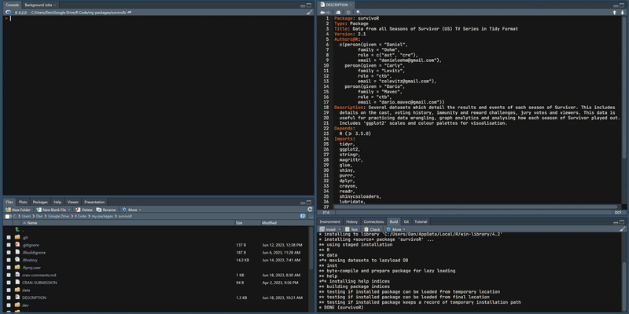
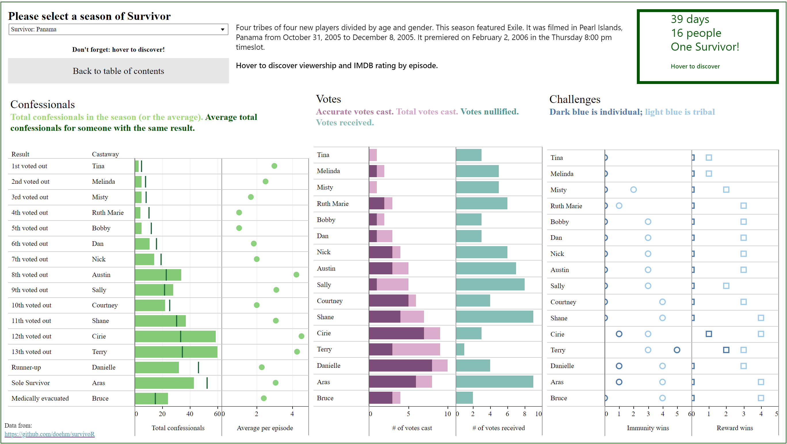
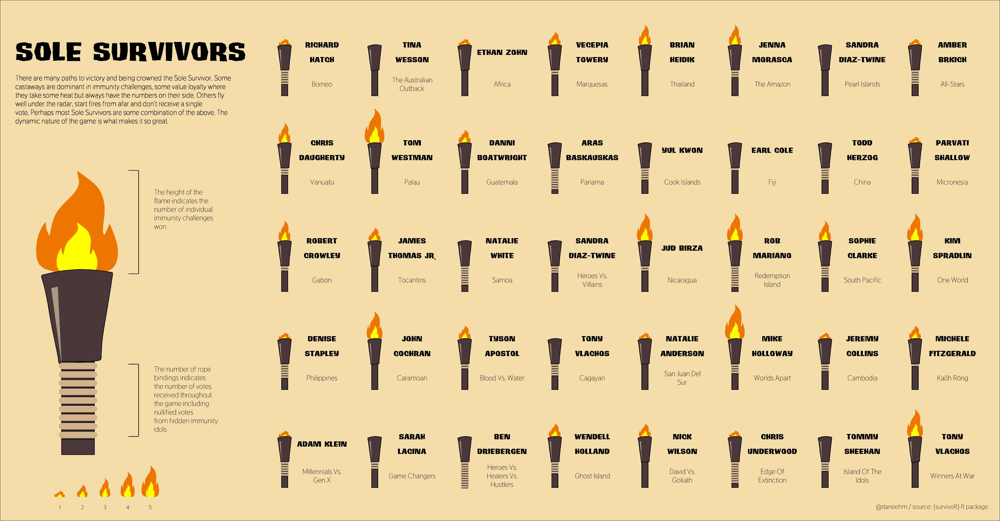

# survivoR 

76 seasons. 1441 people. 1 package!

survivoR is a collection of data sets detailing events across 76 seasons
of Survivor US, Australia, South Africa, New Zealand and UK. It includes
castaway information, vote history, immunity and reward challenge
winners, jury votes, advantage details and a lot more.

For analysis and updates you can follow me on Bluesky
[@danoehm.bsky.social](https://bsky.app/profile/danoehm.bsky.social)

For those that aren’t R users you can get the data by [downloading as an
xlsx](https://github.com/doehm/survivoR/raw/refs/heads/master/dev/xlsx/survivoR.xlsx).

For those that don’t want to do the wrangling, check out the
[survivorstatsdb](https://survivorstatsdb.com).

You can also access the data in [JSON
format](https://github.com/doehm/survivoR/tree/master/dev/json) to feed
directly into applications

# Installation

Install from CRAN (**v2.3.10**) or Git (**v2.3.10**).

If Git \> CRAN I’d suggest install from Git. We are constantly improving
the data sets so the github version is likely to be slightly improved.

``` r
install.packages("survivoR")
```

``` r
devtools::install_github("doehm/survivoR")
```

# Next release

The next release will be at the conclusion of Season 49.

# News: survivoR 2.3.10


- Fix for dplyr update
- in `challenge_description` the field `turn_based` is now `rounds`. So
  there are three types of challenges - races, endurance challenges, and
  challenges played in rounds e.g. By Any Means Necessary. ‘Rounds’
  better reflects the type of challenge it is.

# survivorstatsdb

[**survivorstatsdb**](https://survivorstatsdb.com) is the survivoR
package’s companion. It holds interactive tables and charts detailing
the castaways, challenges, vote history, confessionals, ratings, and
more.

[**Explore player profiles**](https://survivorstatsdb.com/directory):
Explore individual player stats for a season and their Survivor career.

[**Analyse the data**](https://survivorstatsdb.com/castaways.html): All
the data in one place to quickly compare and rank players across
seasons.

<a href='https://survivorstatsdb.com/'></a>

# Confessional timing

Included in the package is a confessional timing app to record the
length of confessionals while watching the episode.

To launch the app, first install the package and run,

``` r
library(survivoR)
launch_confessional_app()
```

<a href='https://github.com/doehm/survivoR/tree/master/inst'></a>

To try it out online 👉 [Confessional timing
app](https://danieloehm.shinyapps.io/survivorDash/)

More info [here](https://github.com/doehm/survivoR/tree/master/inst).

# Dataset overview

There are 19 data sets included in the package:

1.  `advantage_movement`
2.  `advantage_details`
3.  `boot_mapping`
4.  `castaway_details`
5.  `castaway_scores`
6.  `castaways`
7.  `challenge_results`
8.  `challenge_description`
9.  `challenge_summary`
10. `confessionals`
11. `jury_votes`
12. `season_summary`
13. `tribe_colours`
14. `tribe_mapping`
15. `episodes`
16. `vote_history`
17. `survivor_auction`
18. `auction_details`
19. `screen_time`
20. `season_palettes`
21. `journeys`

See the sections below for more details on the key data sets.

<details>

<summary>

<strong>Season summary</strong>
</summary>

## Season summary

A table containing summary details of each season of Survivor, including
the winner, runner ups and location.

``` r
season_summary
#> # A tibble: 76 × 26
#>    version version_season season_name season location country tribe_setup n_cast
#>    <chr>   <chr>          <chr>        <dbl> <chr>    <chr>   <chr>        <int>
#>  1 US      US50           Survivor: …     50 <NA>     <NA>     <NA>           24
#>  2 US      US49           Survivor: …     49 Mamanuc… Fiji    "Three tri…     18
#>  3 US      US48           Survivor: …     48 Mamanuc… Fiji    "Three tri…     18
#>  4 US      US47           Survivor: …     47 Mamanuc… Fiji    "Three tri…     18
#>  5 US      US46           Survivor: …     46 Mamanuc… Fiji    "Three tri…     18
#>  6 US      US45           Survivor: …     45 Mamanuc… Fiji    "Three tri…     18
#>  7 US      US44           Survivor: …     44 Mamanuc… Fiji    "Three tri…     18
#>  8 US      US43           Survivor: …     43 Mamanuc… Fiji    "Three tri…     18
#>  9 US      US42           Survivor: …     42 Mamanuc… Fiji    "Three tri…     18
#> 10 US      US41           Survivor: …     41 Mamanuc… Fiji    "Three tri…     18
#> 11 US      US40           Survivor: …     40 Mamanuc… Fiji    "Two tribe…     20
#> 12 US      US39           Survivor: …     39 Mamanuc… Fiji    "Two tribe…     20
#> 13 US      US38           Survivor: …     38 Mamanuc… Fiji    "Two tribe…     18
#> 14 US      US37           Survivor: …     37 Mamanuc… Fiji    "Two tribe…     20
#> 15 US      US36           Survivor: …     36 Mamanuc… Fiji    "Two tribe…     20
#> 16 US      US35           Survivor: …     35 Mamanuc… Fiji    "Three tri…     18
#> 17 US      US34           Survivor: …     34 Mamanuc… Fiji    "Two tribe…     20
#> 18 US      US33           Survivor: …     33 Mamanuc… Fiji    "Two tribe…     20
#> 19 US      US32           Survivor: …     32 Koh Ron… Cambod… "Three tri…     18
#> 20 US      US31           Survivor: …     31 Koh Ron… Cambod… "Two tribe…     20
#> 21 US      US30           Survivor: …     30 San Jua… Nicara… "Three tri…     18
#> 22 US      US29           Survivor: …     29 San Jua… Nicara… "Nine pair…     18
#> 23 US      US28           Survivor: …     28 Palaui … Philip… "Three tri…     18
#> 24 US      US27           Survivor: …     27 Palaui … Philip… "Two tribe…     20
#> 25 US      US26           Survivor: …     26 Caramoa… Philip… "Two tribe…     20
#> 26 US      US25           Survivor: …     25 Caramoa… Philip… "Three tri…     18
#> 27 US      US24           Survivor: …     24 San Jua… Nicara… "Two tribe…     18
#> 28 US      US23           Survivor: …     23 San Jua… Nicara… "Upolu, Sa…     18
#> 29 US      US22           Survivor: …     22 San Jua… Nicara… "Two tribe…     18
#> 30 US      US21           Survivor: …     21 San Jua… Nicara… "Two tribe…     20
#> # ℹ 46 more rows
#> # ℹ 18 more variables: n_tribes <int>, n_finalists <int>, n_jury <int>,
#> #   full_name <chr>, winner_id <chr>, winner <chr>, runner_ups <chr>,
#> #   final_vote <chr>, timeslot <chr>, premiered <date>, ended <date>,
#> #   filming_started <date>, filming_ended <date>, viewers_reunion <dbl>,
#> #   viewers_premiere <dbl>, viewers_finale <dbl>, viewers_mean <dbl>,
#> #   rank <dbl>
```

</details>

<details>

<summary>

<strong>Castaways</strong>
</summary>

## Castaways

This data set contains season and demographic information about each
castaway. It is structured to view their results for each season.
Castaways that have played in multiple seasons will feature more than
once with the age and location representing that point in time.
Castaways that re-entered the game will feature more than once in the
same season as they technically have more than one boot order
e.g. Natalie Anderson - Winners at War.

Each castaway has a unique `castaway_id` which links the individual
across all data sets and seasons. It also links to the following ID’s
found on the `vote_history`, `jury_votes` and `challenges` data sets.

- `vote_id`
- `voted_out_id`
- `finalist_id`

``` r
castaways |> 
  filter(season == 45)
#> # A tibble: 18 × 26
#>    version version_season season full_name      castaway_id castaway   age city 
#>    <chr>   <chr>           <dbl> <chr>          <chr>       <chr>    <dbl> <chr>
#>  1 US      US45               45 Hannah Rose    US0669      Hannah      33 Balt…
#>  2 US      US45               45 Brandon Donlon US0665      Brandon     25 Sick…
#>  3 US      US45               45 Sabiyah Brode… US0677      Sabiyah     27 Jack…
#>  4 US      US45               45 Sean Edwards   US0678      Sean        34 Prov…
#>  5 US      US45               45 Brando Meyer   US0664      Brando      23 Seat…
#>  6 US      US45               45 J. Maya        US0670      J. Maya     24 Los …
#>  7 US      US45               45 Sifu Alsup     US0679      Sifu        30 O'Fa…
#>  8 US      US45               45 Kaleb Gebrewo… US0673      Kaleb       29 Vanc…
#>  9 US      US45               45 Kellie Nalban… US0675      Kellie      30 New …
#> 10 US      US45               45 Kendra McQuar… US0676      Kendra      30 Stea…
#> 11 US      US45               45 Bruce Perreau… US0657      Bruce       46 Warw…
#> 12 US      US45               45 Emily Flippen  US0668      Emily       28 Laur…
#> 13 US      US45               45 Drew Basile    US0667      Drew        23 Phil…
#> 14 US      US45               45 Julie Alley    US0672      Julie       49 Bren…
#> 15 US      US45               45 Katurah Topps  US0674      Katurah     34 Broo…
#> 16 US      US45               45 Jake O'Kane    US0671      Jake        26 Bost…
#> 17 US      US45               45 Austin Li Coon US0663      Austin      26 Chic…
#> 18 US      US45               45 Dee Valladares US0666      Dee         26 Miami
#> # ℹ 18 more variables: state <chr>, episode <dbl>, day <dbl>, order <dbl>,
#> #   result <chr>, jury_status <chr>, place <int>, original_tribe <chr>,
#> #   jury <lgl>, finalist <lgl>, winner <lgl>, acknowledge <lgl>,
#> #   ack_look <lgl>, ack_speak <lgl>, ack_gesture <lgl>, ack_smile <lgl>,
#> #   ack_quote <chr>, ack_score <int>
```

## Castaway details

A few castaways have changed their name from season to season or have
been referred to by a different name during the season e.g. Amber
Mariano; in season 8 Survivor All-Stars there was Rob C and Rob M. That
information has been retained here in the `castaways` data set.

`castaway_details` contains unique information for each castaway. It
takes the full name from their most current season and their most
verbose short name which is handy for labelling.

It also includes gender, date of birth, occupation, race, ethnicity and
other data. If no source was found to determine a castaways race and
ethnicity, the data is kept as missing rather than making an assumption.

`african_american`, `asian_american`, `latin_american`,
`native_american`, `race`, `ethnicity`, and `bipoc` data is complete
only for the US. `bipoc` is `TRUE` when any of the `*_american` fields
are `TRUE`. These fields have been recorded as per the (Survivor
wiki)\[<https://survivor.fandom.com/wiki/Main_Page>\]. Other versions
have been left blank as the data is not complete and the term ‘people of
colour’ is typically only used in the US.

I have deprecated the old field `poc` in order to be more inclusive and
to make using the race/ethnicity fields simpler.

I have included a `collar` field is experimental and derived from a
language model. I suggest caution with it’s use as many occupations may
not fit neatly into a classification.

``` r
castaway_details
#> # A tibble: 1,200 × 22
#>    castaway_id full_name     full_name_detailed castaway last_name date_of_birth
#>    <chr>       <chr>         <chr>              <chr>    <chr>     <date>       
#>  1 US0001      Sonja Christ… Sonja Christopher  Sonja    Christop… 1937-01-28   
#>  2 US0002      B.B. Andersen B.B. Andersen      B.B.     Andersen  1936-01-18   
#>  3 US0003      Stacey Still… Stacey Stillman    Stacey   Stillman  1972-08-11   
#>  4 US0004      Ramona Gray   Ramona Gray        Ramona   Gray      1971-01-20   
#>  5 US0005      Dirk Been     Dirk Been          Dirk     Been      1976-06-15   
#>  6 US0006      Joel Klug     Joel Klug          Joel     Klug      1972-04-13   
#>  7 US0007      Gretchen Cor… Gretchen Cordy     Gretchen Cordy     1962-02-07   
#>  8 US0008      Greg Buis     Greg Buis          Greg     Buis      1975-12-31   
#>  9 US0009      Jenna Lewis   Jenna Lewis        Jenna L. Lewis     1977-07-16   
#> 10 US0010      Gervase Pete… Gervase Peterson   Gervase  Peterson  1969-11-02   
#> 11 US0011      Colleen Hask… Colleen Haskell    Colleen  Haskell   1976-12-06   
#> 12 US0012      Sean Kenniff  Sean Kenniff       Sean     Kenniff   1969-11-27   
#> 13 US0013      Susan Hawk    Susan Hawk         Sue      Hawk      1961-08-17   
#> 14 US0014      Rudy Boesch   Rudy Boesch        Rudy     Boesch    1928-01-20   
#> 15 US0015      Kelly Wigles… Kelly Wiglesworth  Kelly    Wigleswo… 1977-06-24   
#> 16 US0016      Richard Hatch Richard Hatch      Richard  Hatch     1961-04-08   
#> 17 US0017      Debb Eaton    Debb Eaton         Debb     Eaton     1955-06-11   
#> 18 US0018      Kel Gleason   Kel Gleason        Kel      Gleason   1968-01-05   
#> 19 US0019      Maralyn Hers… Maralyn Hershey    Maralyn  Hershey   1949-01-24   
#> 20 US0020      Mitchell Ols… Mitchell Olson     Mitchell Olson     1977-03-17   
#> 21 US0021      Kimmi Kappen… Kimmi Kappenberg   Kimmi    Kappenbe… 1972-11-11   
#> 22 US0022      Michael Skup… Michael Skupin     Michael  Skupin    1962-01-29   
#> 23 US0023      Jeff Varner   Jeff Varner        Jeff     Varner    1966-04-16   
#> 24 US0024      Alicia Calaw… Alicia Calaway     Alicia   Calaway   1968-05-01   
#> 25 US0025      Jerri Manthey Jerri Manthey      Jerri    Manthey   1970-09-05   
#> 26 US0026      Nick Brown    Nick Brown         Nick     Brown     1977-04-02   
#> 27 US0027      Amber Mariano Amber Mariano      Amber    Mariano   1978-08-11   
#> 28 US0028      Rodger Bingh… Rodger Bingham     Rodger   Bingham   1947-07-05   
#> 29 US0029      Elisabeth Fi… Elisabeth Filarski Elisabe… Filarski  1977-05-28   
#> 30 US0030      Keith Famie   Keith Famie        Keith    Famie     1960-02-11   
#> # ℹ 1,170 more rows
#> # ℹ 16 more variables: date_of_death <date>, gender <chr>, african <lgl>,
#> #   asian <lgl>, latin_american <lgl>, native_american <lgl>, bipoc <lgl>,
#> #   lgbt <lgl>, personality_type <chr>, occupation <chr>, collar <chr>,
#> #   three_words <chr>, hobbies <chr>, pet_peeves <chr>, race <chr>,
#> #   ethnicity <chr>
```

## Castaway scores

I have created a measure for challenge success, vote history or tribal
council success and advantage success. For more details please see
follow the links:

``` r
castaway_scores
#> # A tibble: 1,147 × 55
#>    version version_season season castaway castaway_id score_overall score_outwit
#>    <fct>   <chr>           <dbl> <chr>    <chr>               <dbl>        <dbl>
#>  1 US      US01                1 Sonja    US0001             0.0266  0.000000953
#>  2 US      US01                1 B.B.     US0002             0.0612  0.0120     
#>  3 US      US01                1 Stacey   US0003             0.124   0.137      
#>  4 US      US01                1 Ramona   US0004             0.233   0.355      
#>  5 US      US01                1 Dirk     US0005             0.269   0.391      
#>  6 US      US01                1 Joel     US0006             0.349   0.517      
#>  7 US      US01                1 Gretchen US0007             0.555   0.689      
#>  8 US      US01                1 Greg     US0008             0.556   0.424      
#>  9 US      US01                1 Jenna    US0009             0.522   0.561      
#> 10 US      US01                1 Gervase  US0010             0.591   0.455      
#> 11 US      US01                1 Colleen  US0011             0.613   0.516      
#> 12 US      US01                1 Sean     US0012             0.555   0.529      
#> 13 US      US01                1 Sue      US0013             0.575   0.653      
#> 14 US      US01                1 Rudy     US0014             0.560   0.503      
#> 15 US      US01                1 Kelly    US0015             0.852   0.748      
#> 16 US      US01                1 Richard  US0016             0.663   0.706      
#> 17 US      US02                2 Debb     US0017             0.0266  0.00000524 
#> 18 US      US02                2 Kel      US0018             0.0577  0.00330    
#> 19 US      US02                2 Maralyn  US0019             0.205   0.318      
#> 20 US      US02                2 Mitchell US0020             0.271   0.450      
#> 21 US      US02                2 Kimmi    US0021             0.297   0.442      
#> 22 US      US02                2 Michael  US0022             0.432   0.715      
#> 23 US      US02                2 Jeff     US0023             0.517   0.582      
#> 24 US      US02                2 Alicia   US0024             0.508   0.536      
#> 25 US      US02                2 Jerri    US0025             0.585   0.597      
#> 26 US      US02                2 Nick     US0026             0.529   0.382      
#> 27 US      US02                2 Amber    US0027             0.476   0.415      
#> 28 US      US02                2 Rodger   US0028             0.491   0.406      
#> 29 US      US02                2 Elisabe… US0029             0.547   0.537      
#> 30 US      US02                2 Keith    US0030             0.625   0.527      
#> # ℹ 1,117 more rows
#> # ℹ 48 more variables: score_outplay <dbl>, score_outlast <dbl>,
#> #   score_result <dbl>, score_jury <dbl>, score_vote <dbl>, score_adv <dbl>,
#> #   score_inf <dbl>, r_score_chal_all <dbl>, r_score_chal_immunity <dbl>,
#> #   r_score_chal_reward <dbl>, r_score_chal_tribal <dbl>,
#> #   r_score_chal_tribal_immunity <dbl>, r_score_chal_tribal_reward <dbl>,
#> #   r_score_chal_individual <dbl>, r_score_chal_individual_immunity <dbl>, …
```

</details>

<details>

<summary>

<strong>Vote history</strong>
</summary>

## Vote history

This data frame contains a complete history of votes cast across all
seasons of Survivor. This allows you to see who who voted for who at
which Tribal Council. It also includes details on who had individual
immunity as well as who had their votes nullified by a hidden immunity
idol. This details the key events for the season.

There is some information on split votes to help calculate if a player
engaged in a split vote but ultimately hit their target. There are
events which influence the vote e.g. Extra votes, safety without power,
etc. These are recorded here as well.

``` r
vh <- vote_history |> 
  filter(
    season == 45,
    episode == 9
  ) 
vh
#> # A tibble: 9 × 23
#>   version version_season season episode   day tribe_status tribe    castaway
#>   <chr>   <chr>           <dbl>   <dbl> <dbl> <chr>        <chr>    <chr>   
#> 1 US      US45               45       9    17 Merged       Dakuwaqa Bruce   
#> 2 US      US45               45       9    17 Merged       Dakuwaqa Jake    
#> 3 US      US45               45       9    17 Merged       Dakuwaqa Katurah 
#> 4 US      US45               45       9    17 Merged       Dakuwaqa Dee     
#> 5 US      US45               45       9    17 Merged       Dakuwaqa Julie   
#> 6 US      US45               45       9    17 Merged       Dakuwaqa Kendra  
#> 7 US      US45               45       9    17 Merged       Dakuwaqa Emily   
#> 8 US      US45               45       9    17 Merged       Dakuwaqa Austin  
#> 9 US      US45               45       9    17 Merged       Dakuwaqa Drew    
#> # ℹ 15 more variables: immunity <chr>, vote <chr>, vote_event <chr>,
#> #   vote_event_outcome <chr>, split_vote <chr>, nullified <lgl>, tie <lgl>,
#> #   voted_out <chr>, order <dbl>, vote_order <dbl>, castaway_id <chr>,
#> #   vote_id <chr>, voted_out_id <chr>, sog_id <dbl>, challenge_id <dbl>
```

``` r
vh |> 
  count(vote)
#> # A tibble: 3 × 2
#>   vote       n
#>   <chr>  <int>
#> 1 Jake       1
#> 2 Kendra     6
#> 3 <NA>       2
```

</details>

<details>

<summary>

<strong>Challenges</strong>
</summary>

## Challenge results

There are 3 tables `challenge_results`, `challenge_description`, and
`challenge_summary`.

### Challenge results

A tidy data frame of immunity and reward challenge results. The winners
and losers of the challenges are found recorded here.

Update: The `results` field will be deprecated. Instead start using the
`won` and `won_*` fields. These better handle the challenges with
multiple outcomes such as ‘Team / Individual’ challenges.

``` r
challenge_results |> 
  filter(season == 48) |> 
  group_by(castaway) |> 
  summarise_at(vars(starts_with("won")), sum)
#> # A tibble: 18 × 9
#>    castaway    won won_tribal_reward won_tribal_immunity won_team_reward
#>    <chr>     <dbl>             <dbl>               <dbl>           <dbl>
#>  1 Bianca        5                 5                   4               0
#>  2 Cedrek        2                 1                   1               1
#>  3 Charity       6                 5                   5               0
#>  4 Chrissy       5                 4                   4               1
#>  5 David         9                 5                   5               3
#>  6 Eva           8                 6                   5               1
#>  7 Joe          11                 5                   4               1
#>  8 Justin        0                 0                   0               0
#>  9 Kamilla       9                 4                   4               2
#> 10 Kevin         1                 1                   0               0
#> 11 Kyle         10                 4                   4               2
#> 12 Mary          6                 2                   2               3
#> 13 Mitch         4                 4                   4               0
#> 14 Sai           2                 1                   1               1
#> 15 Shauhin       8                 5                   4               1
#> 16 Star          8                 6                   5               1
#> 17 Stephanie     0                 0                   0               0
#> 18 Thomas        4                 4                   3               0
#> # ℹ 4 more variables: won_team_immunity <dbl>, won_individual_reward <dbl>,
#> #   won_individual_immunity <dbl>, won_duel <dbl>
```

The `challenge_id` is the primary key for the `challenge_description`
data set. The `challange_id` will change as the data or descriptions
change.

## Challenge description

This data set contains the name, description, and descriptive features
for each challenge where it is known. Challenges can go by different
names so have included the unique name and the recurring challenge name.
These are taken directly from the [Survivor
Wiki](https://survivor.fandom.com/wiki/Category:Recurring_Challenges).
Sometimes there can be variations made on the challenge but go but the
same name, or the challenge is integrated with a longer obstacle. In
these cases the challenge may share the same recurring challenge name
but have a different challenge name. Even if they share the same names
the description could be different.

The features of each challenge have been determined largely through
string searches of key words that describe the challenge. It may not be
100% accurate due to the different and inconsistent descriptions but in
most part they will provide a good basis for analysis.

If any descriptive features need altering please let me know in the
[issues](https://github.com/doehm/survivoR/issues).

``` r
challenge_description
#> # A tibble: 1,904 × 46
#>    version version_season season episode challenge_id challenge_number
#>    <fct>   <chr>           <dbl>   <dbl>        <dbl>            <dbl>
#>  1 US      US49               49       1            1                1
#>  2 US      US49               49       1            2                2
#>  3 US      US49               49       1            3                3
#>  4 US      US49               49       2            4                1
#>  5 US      US49               49       3            5                1
#>  6 US      US49               49       4            6                1
#>  7 US      US49               49       5            7                1
#>  8 US      US49               49       6            8                1
#>  9 US      US49               49       6            9                2
#> 10 US      US49               49       7           10                1
#> 11 US      US49               49       7           11                2
#> 12 US      US49               49       8           12                1
#> 13 US      US49               49       9           13                1
#> 14 US      US49               49       9           14                2
#> 15 US      US49               49      10           15                1
#> 16 US      US49               49      10           16                2
#> 17 US      US49               49      11           17                1
#> 18 US      US49               49      12           18                1
#> 19 US      US49               49      12           19                2
#> 20 US      US49               49      13           20                1
#> 21 US      US49               49      13           21                2
#> 22 US      US48               48       1            1                1
#> 23 US      US48               48       1            2                2
#> 24 US      US48               48       1            3                3
#> 25 US      US48               48       2            4                1
#> 26 US      US48               48       3            5                1
#> 27 US      US48               48       4            6                1
#> 28 US      US48               48       5            7                1
#> 29 US      US48               48       5            8                2
#> 30 US      US48               48       6            9                1
#> # ℹ 1,874 more rows
#> # ℹ 40 more variables: challenge_type <chr>, name <chr>, recurring_name <chr>,
#> #   all_names <chr>, description <chr>, reward <chr>,
#> #   additional_stipulation <chr>, balance <lgl>, balance_ball <lgl>,
#> #   balance_beam <lgl>, endurance <lgl>, fire <lgl>, food <lgl>,
#> #   knowledge <lgl>, memory <lgl>, mud <lgl>, obstacle_blindfolded <lgl>,
#> #   obstacle_cargo_net <lgl>, obstacle_chopping <lgl>, …

challenge_description |> 
  summarise_if(is_logical, ~sum(.x, na.rm = TRUE)) |> 
  glimpse()
#> Rows: 1
#> Columns: 33
#> $ balance                   <int> 370
#> $ balance_ball              <int> 49
#> $ balance_beam              <int> 161
#> $ endurance                 <int> 455
#> $ fire                      <int> 69
#> $ food                      <int> 24
#> $ knowledge                 <int> 77
#> $ memory                    <int> 29
#> $ mud                       <int> 50
#> $ obstacle_blindfolded      <int> 52
#> $ obstacle_cargo_net        <int> 160
#> $ obstacle_chopping         <int> 32
#> $ obstacle_combination_lock <int> 22
#> $ obstacle_digging          <int> 101
#> $ obstacle_knots            <int> 44
#> $ obstacle_padlocks         <int> 76
#> $ precision                 <int> 313
#> $ precision_catch           <int> 65
#> $ precision_roll_ball       <int> 14
#> $ precision_slingshot       <int> 54
#> $ precision_throw_balls     <int> 81
#> $ precision_throw_coconuts  <int> 24
#> $ precision_throw_rings     <int> 21
#> $ precision_throw_sandbags  <int> 67
#> $ puzzle                    <int> 419
#> $ puzzle_slide              <int> 17
#> $ puzzle_word               <int> 29
#> $ race                      <int> 1362
#> $ rounds                    <int> 207
#> $ strength                  <int> 135
#> $ water                     <int> 365
#> $ water_paddling            <int> 151
#> $ water_swim                <int> 270
```

See the help manual for more detailed descriptions of the features.

### Challenge Summary

The `challenge_summary` table is solving an annoying problem with
`challenge_results` and the way some challenges are constructed. You may
want to count how many individual challenges someone has won, or tribal
immunities, etc. To do so you’ll have to use the `challenge_type`,
`outcome_type`, and `results` fields. There are some challenges which
are combined e.g. `Team / Individual` challenges which makes this not a
straight process to summarise the table.

Hence why `challenge_summary` exisits. The `category` column consists of
the following categories:

- All: All challenge types
- Reward
- Immunity
- Tribal
- Tribal Reward
- Tribal Immunity
- Individual
- Individual Reward
- Individual Immunity
- Team
- Team Reward
- Team Immunity
- Duel

There is obviously overlap with the categories but this structure makes
it simple to summarise the table how you desire e.g.

``` r
challenge_summary |> 
  group_by(category, version_season, castaway) |> 
  summarise(
    n_challenges = n(), 
    n_won = sum(won)
    )
#> # A tibble: 11,994 × 5
#> # Groups:   category, version_season [779]
#>    category version_season castaway      n_challenges n_won
#>    <chr>    <chr>          <chr>                <int> <dbl>
#>  1 All      AU01           Andrew                  17     7
#>  2 All      AU01           Barry                    9     5
#>  3 All      AU01           Bianca                   3     2
#>  4 All      AU01           Brooke                  29    20
#>  5 All      AU01           Conner                  22     8
#>  6 All      AU01           Craig                   18     7
#>  7 All      AU01           Des                      2     0
#>  8 All      AU01           El                      33    16
#>  9 All      AU01           Evan                     5     1
#> 10 All      AU01           Flick                   32    18
#> 11 All      AU01           Jennah-Louise           27    18
#> 12 All      AU01           Kat                     15     5
#> 13 All      AU01           Kate                    23     7
#> 14 All      AU01           Kristie                 33     6
#> 15 All      AU01           Kylie                   25    19
#> 16 All      AU01           Lee                     33    17
#> 17 All      AU01           Matt                    31    18
#> 18 All      AU01           Nick                    24    17
#> 19 All      AU01           Peter                    6     5
#> 20 All      AU01           Phoebe                  21     5
#> 21 All      AU01           Rohan                   14     5
#> 22 All      AU01           Sam                     30    18
#> 23 All      AU01           Sue                     26     7
#> 24 All      AU01           Tegan                   11     7
#> 25 All      AU02           AK                      21    12
#> 26 All      AU02           Adam                     5     3
#> 27 All      AU02           Aimee                   10     5
#> 28 All      AU02           Anneliese               28    13
#> 29 All      AU02           Ben                     22    11
#> 30 All      AU02           Henry                   29    15
#> # ℹ 11,964 more rows
```

How to add the challenge scores to challenge summary.

``` r

challenge_summary |>
  group_by(category, version_season, castaway_id, castaway) |>
  summarise(
    n_challenges = n_distinct(challenge_id),
    n_won = sum(won),
    .groups = "drop"
  ) |>
  left_join(
    castaway_scores |>
      select(version_season, castaway_id, starts_with("score_chal")) |>
      pivot_longer(c(-version_season, -castaway_id), names_to = "category", values_to = "score") |>
      mutate(
        category = str_remove(category, "score_chal_"),
        category = str_replace_all(category, "_", " "),
        category = str_to_title(category)
      ) |>
      select(category, version_season, castaway_id, score),
    join_by(category, version_season, castaway_id)
  )
#> Error in `pivot_longer()`:
#> ! `cols` must select at least one column.
```

See the R docs for more details on the fields. Join to
`challenge_results` with `version_season` and `challenge_id`.

</details>

<details>

<summary>

<strong>Jury votes</strong>
</summary>

## Jury votes

History of jury votes. It is more verbose than it needs to be, however
having a 0-1 column indicating if a vote was placed or not makes it
easier to summarise castaways that received no votes.

``` r
jury_votes |> 
  filter(season == 45)
#> # A tibble: 24 × 8
#>    version version_season season castaway finalist  vote castaway_id finalist_id
#>    <chr>   <chr>           <dbl> <chr>    <chr>    <dbl> <chr>       <chr>      
#>  1 US      US45               45 Bruce    Austin       1 US0657      US0663     
#>  2 US      US45               45 Drew     Austin       1 US0667      US0663     
#>  3 US      US45               45 Emily    Austin       0 US0668      US0663     
#>  4 US      US45               45 Julie    Austin       0 US0672      US0663     
#>  5 US      US45               45 Kaleb    Austin       0 US0673      US0663     
#>  6 US      US45               45 Katurah  Austin       0 US0674      US0663     
#>  7 US      US45               45 Kellie   Austin       0 US0675      US0663     
#>  8 US      US45               45 Kendra   Austin       1 US0676      US0663     
#>  9 US      US45               45 Bruce    Dee          0 US0657      US0666     
#> 10 US      US45               45 Drew     Dee          0 US0667      US0666     
#> 11 US      US45               45 Emily    Dee          1 US0668      US0666     
#> 12 US      US45               45 Julie    Dee          1 US0672      US0666     
#> 13 US      US45               45 Kaleb    Dee          1 US0673      US0666     
#> 14 US      US45               45 Katurah  Dee          1 US0674      US0666     
#> 15 US      US45               45 Kellie   Dee          1 US0675      US0666     
#> 16 US      US45               45 Kendra   Dee          0 US0676      US0666     
#> 17 US      US45               45 Bruce    Jake         0 US0657      US0671     
#> 18 US      US45               45 Drew     Jake         0 US0667      US0671     
#> 19 US      US45               45 Emily    Jake         0 US0668      US0671     
#> 20 US      US45               45 Julie    Jake         0 US0672      US0671     
#> 21 US      US45               45 Kaleb    Jake         0 US0673      US0671     
#> 22 US      US45               45 Katurah  Jake         0 US0674      US0671     
#> 23 US      US45               45 Kellie   Jake         0 US0675      US0671     
#> 24 US      US45               45 Kendra   Jake         0 US0676      US0671
```

``` r
jury_votes |> 
  filter(season == 45) |> 
  group_by(finalist) |> 
  summarise(votes = sum(vote))
#> # A tibble: 3 × 2
#>   finalist votes
#>   <chr>    <dbl>
#> 1 Austin       3
#> 2 Dee          5
#> 3 Jake         0
```

</details>

<details>

<summary>

<strong>Advantages</strong>
</summary>

## Advantage Details

This dataset lists the hidden idols and advantages in the game for all
seasons. It details where it was found, if there was a clue to the
advantage, location and other advantage conditions. This maps to the
`advantage_movement` table.

``` r
advantage_details |> 
  filter(season == 45)
#> # A tibble: 10 × 8
#>    version version_season season advantage_id advantage_type       clue_details 
#>    <chr>   <chr>           <dbl>        <dbl> <chr>                <chr>        
#>  1 US      US45               45            1 Hidden Immunity Idol No clue      
#>  2 US      US45               45            2 Hidden Immunity Idol No clue      
#>  3 US      US45               45            3 Safety without Power No clue      
#>  4 US      US45               45            4 Goodwill Advantage   No clue      
#>  5 US      US45               45            5 Amulet               No clue      
#>  6 US      US45               45            6 Amulet               No clue      
#>  7 US      US45               45            7 Amulet               No clue      
#>  8 US      US45               45            8 Hidden Immunity Idol No clue      
#>  9 US      US45               45            9 Hidden Immunity Idol Found around…
#> 10 US      US45               45           10 Challenge Advantage  No clue      
#> # ℹ 2 more variables: location_found <chr>, conditions <chr>
```

## Advantage Movement

The `advantage_movement` table tracks who found the advantage, who they
may have handed it to and who the played it for. Each step is called an
event. The `sequence_id` tracks the logical step of the advantage. For
example in season 41, JD found an Extra Vote advantage. JD gave it to
Shan in good faith who then voted him out keeping the Extra Vote. Shan
gave it to Ricard in good faith who eventually gave it back before Shan
played it for Naseer. That movement is recorded in this table.

``` r
advantage_movement |> 
  filter(advantage_id == "USEV4102")
#> # A tibble: 0 × 15
#> # ℹ 15 variables: version <chr>, version_season <chr>, season <dbl>,
#> #   castaway <chr>, castaway_id <chr>, advantage_id <dbl>, sequence_id <dbl>,
#> #   day <dbl>, episode <dbl>, event <chr>, played_for <chr>,
#> #   played_for_id <chr>, success <chr>, votes_nullified <dbl>, sog_id <dbl>
```

</details>

<details>

<summary>

<strong>Confessionals</strong>
</summary>

## Confessionals

A dataset containing the number of confessionals for each castaway by
season and episode. There are multiple contributors to this data. Where
there are multiple sets of counts for a season the average is taken and
added to the package. The aim is to establish consistency in
confessional counts in the absence of official sources. Given the
subjective nature of the counts and the potential for clerical error no
single source is more valid than another. So it is reasonable to average
across all sources.

Confessional time exists for a few seasons. This is the total cumulative
time for each castaway in seconds. This is a much more accurate
indicator of the ‘edit’.

``` r
confessionals |> 
  filter(season == 45) |> 
  group_by(castaway) |> 
  summarise(
    count = sum(confessional_count),
    time = sum(confessional_time)
    )
#> # A tibble: 18 × 3
#>    castaway count  time
#>    <chr>    <dbl> <dbl>
#>  1 Austin      72  1436
#>  2 Brando      10   147
#>  3 Brandon     12   214
#>  4 Bruce       38   735
#>  5 Dee         67  1102
#>  6 Drew        64  1171
#>  7 Emily       62  1332
#>  8 Hannah       4    44
#>  9 J. Maya     11   210
#> 10 Jake        60  1290
#> 11 Julie       46   814
#> 12 Kaleb       45   692
#> 13 Katurah     66  1169
#> 14 Kellie      29   515
#> 15 Kendra      37   506
#> 16 Sabiyah     22   342
#> 17 Sean        16   325
#> 18 Sifu        11   236
```

The confessional index is available on this data set. The index is a
standardised measure of the number of confessionals the player has
received compared to the others. It is stratified by tribe so it
measures how many confessionals each player gets proportional to even
share within tribe e.g. an index of 1.5 means that player as received
50% more than others in their tribe.

The tribe grouping is important since the tribe that attends tribal
council typical get more screen time, which is fair enough. I don’t
think we should expect even share across everyone in the pre-merge stage
of the game.

The index is cumulative with episode, so the players final index is the
index in their final episode.

``` r
confessionals |> 
  filter(season == 45) |> 
  group_by(castaway) |> 
  slice_max(episode) |> 
  arrange(desc(index_time)) |> 
  select(castaway, episode, confessional_count, confessional_time, index_count, index_time)
#> Error in `arrange()`:
#> ℹ In argument: `..1 = index_time`.
#> Caused by error:
#> ! object 'index_time' not found
```

</details>

<details>

<summary>

<strong>Screen time</strong>
</summary>

## Screen time \[EXPERIMENTAL\]

This dataset contains the estimated screen time for each castaway during
an episode. Please note that this is still in the early days of
development. There is likely to be misclassification and other sources
of error. The model will be refined over time.

An individuals’ screen time is calculated, at a high-level, via the
following process:

1.  Frames are sampled from episodes on a 1 second time interval

2.  MTCNN detects the human faces within each frame

3.  VGGFace2 converts each detected face into a 512d vector space

4.  A training set of labelled images (1 for each contestant + 3 for
    Jeff Probst) is processed in the same way to determine where they
    sit in the vector space. TODO: This could be made more accurate by
    increasing the number of training images per contestant.

5.  The Euclidean distance is calculated for the faces detected in the
    frame to each of the contestants in the season (+Jeff). If the
    minimum distance is greater than 1.2 the face is labelled as
    “unknown”. TODO: Review how robust this distance cutoff truly is -
    currently based on manual review of Season 42.

6.  A multi-class SVM is trained on the training set to label faces. For
    any face not identified as “unknown”, the vector embedding is run
    into this model and a label is generated.

7.  All labelled faces are aggregated together, with an assumption of
    1-5 full second of screen time each time a face is seen and
    factoring in time between detection capping at a max of 5 seconds.


``` r
screen_time |> 
  filter(version_season == "US45") |> 
  group_by(castaway_id) |> 
  summarise(total_mins = sum(screen_time)/60) |> 
  left_join(
    castaway_details |> 
      select(castaway_id, castaway = short_name),
    by = "castaway_id"
  ) |> 
  arrange(desc(total_mins))
#> Error in `select()`:
#> ! Can't select columns that don't exist.
#> ✖ Column `short_name` doesn't exist.
```

Currently it only includes data for season 42. More seasons will be
added as they are completed.

</details>

<details>

<summary>

<strong>Boot mapping</strong>
</summary>

## Boot mapping

A mapping table to detail who is still alive at each stage of the game.
It is useful for easy filtering to say the final players.

``` r
# filter to season 45 and when there are 6 people left
# 18 people in the season, therefore 12 boots

still_alive <- function(.version, .season, .n_boots) {
  survivoR::boot_mapping |>
    filter(
      version == .version,
      season == .season,
      final_n == 6,
      game_status %in% c("In the game", "Returned")
    )
}

still_alive("US", 45, 6)
#> # A tibble: 6 × 13
#>   version version_season season episode order n_boots final_n sog_id castaway_id
#>   <chr>   <chr>           <dbl>   <dbl> <dbl>   <dbl>   <dbl>  <dbl> <chr>      
#> 1 US      US45               45      12    12      12       6     13 US0671     
#> 2 US      US45               45      12    12      12       6     13 US0674     
#> 3 US      US45               45      12    12      12       6     13 US0666     
#> 4 US      US45               45      12    12      12       6     13 US0672     
#> 5 US      US45               45      12    12      12       6     13 US0663     
#> 6 US      US45               45      12    12      12       6     13 US0667     
#> # ℹ 4 more variables: castaway <chr>, tribe <chr>, tribe_status <chr>,
#> #   game_status <chr>
```

</details>

<details>

<summary>

<strong>Episodes</strong>
</summary>

## Episodes

Episodes is an episode level table. It contains the episode information
such as episode title, air date, length, IMDb rating and the viewer
information for every episode across all seasons.

``` r
episodes |> 
  filter(season == 45)
#> # A tibble: 13 × 13
#>    version version_season season episode_number_overall episode episode_title   
#>    <chr>   <chr>           <dbl>                  <dbl>   <dbl> <chr>           
#>  1 US      US45               45                    610       1 We Can Do Hard …
#>  2 US      US45               45                    611       2 Brought a Bazoo…
#>  3 US      US45               45                    612       3 No Man Left Beh…
#>  4 US      US45               45                    613       4 Music to My Ears
#>  5 US      US45               45                    614       5 I Don't Want to…
#>  6 US      US45               45                    615       6 I'm Not Batman,…
#>  7 US      US45               45                    616       7 The Thorn In My…
#>  8 US      US45               45                    617       8 Following a Dea…
#>  9 US      US45               45                    618       9 Sword of Damocl…
#> 10 US      US45               45                    619      10 How Am I the Mo…
#> 11 US      US45               45                    620      11 This Game Rips …
#> 12 US      US45               45                    621      12 The Ex-Girlfrie…
#> 13 US      US45               45                    622      13 Living the Surv…
#> # ℹ 7 more variables: episode_label <chr>, episode_date <date>,
#> #   episode_length <dbl>, viewers <dbl>, imdb_rating <dbl>, n_ratings <dbl>,
#> #   episode_summary <chr>
```

</details>

<details>

<summary>

<strong>Survivor Auction</strong>
</summary>

## Survivor Auction

There are 2 data sets, `survivor_acution` and `auction_details`.
`survivor_auction` simply shows who attended the auction and
`auction_details` holds the details of the auction e.g. who bought what
and at what price.

``` r
auction_details |> 
  filter(season == 45)
#> # A tibble: 11 × 18
#>    version version_season season  item item_description        category castaway
#>    <chr>   <chr>           <dbl> <dbl> <chr>                   <chr>    <chr>   
#>  1 US      US45               45     1 Salty Pretzels And Beer Food an… Kendra  
#>  2 US      US45               45     2 French Fries, Ketchup,… Food an… Kellie  
#>  3 US      US45               45     3 Cheese Platter, Deli M… Food an… Emily   
#>  4 US      US45               45     4 Chocolate Milkshake     Food an… Dee     
#>  5 US      US45               45     5 Two Giant Fish Eyes     Bad item Katurah 
#>  6 US      US45               45     5 Two Giant Fish Eyes     Bad item Austin  
#>  7 US      US45               45     6 Bowl Of Lollies And Ch… Food an… Drew    
#>  8 US      US45               45     7 Slice Of Pepperoni Piz… Food an… Austin  
#>  9 US      US45               45     8 Toothbrush And Toothpa… Comfort  Julie   
#> 10 US      US45               45     9 Chocolate Cake          Food an… Jake    
#> 11 US      US45               45    10 Pbandj Sandwich, Chips… Food an… Kellie  
#> # ℹ 11 more variables: castaway_id <chr>, cost <dbl>, covered <lgl>,
#> #   money_remaining <dbl>, auction_num <dbl>, participated <chr>, notes <chr>,
#> #   alternative_offered <lgl>, alternative_accepted <lgl>, other_item <chr>,
#> #   other_item_category <chr>
```

</details>

<details>

<summary>

<strong>Journeys</strong>
</summary>

## Journeys

Details on Journeys in the New Era including the advantage they won and
if they lost their vote.

``` r
journeys |> 
  filter(season == 45)
#> # A tibble: 10 × 12
#>    version season version_season episode sog_id castaway_id castaway reward     
#>    <chr>    <dbl> <chr>            <dbl>  <dbl> <chr>       <chr>    <chr>      
#>  1 US          45 US45                 2      2 US0657      Bruce    <NA>       
#>  2 US          45 US45                 2      2 US0665      Brandon  Lost vote  
#>  3 US          45 US45                 2      2 US0667      Drew     Safety Wit…
#>  4 US          45 US45                 5      5 US0663      Austin   Amulet     
#>  5 US          45 US45                 5      5 US0675      Kellie   Amulet     
#>  6 US          45 US45                 5      5 US0670      J. Maya  Amulet     
#>  7 US          45 US45                 9     10 US0663      Austin   Regained v…
#>  8 US          45 US45                 9     10 US0668      Emily    Lost vote  
#>  9 US          45 US45                 9     10 US0674      Katurah  Lost vote  
#> 10 US          45 US45                11     12 US0668      Emily    <NA>       
#> # ℹ 4 more variables: lost_vote <lgl>, game_played <chr>, chose_to_play <lgl>,
#> #   event <chr>
```

</details>

# Issues

Given the variable nature of the game of Survivor and changing of the
rules, there are bound to be edges cases where the data is not quite
right. Before logging an issue please install the git version to see if
it has already been corrected. If not, please log an issue and I will
correct the datasets.

New features will be added, such as details on exiled castaways across
the seasons. If you have a request for specific data let me know in the
issues and I’ll see what I can do.

# Showcase

## Survivor Dashboard

**Carly Levitz** has developed a fantastic
[dashboard](https://public.tableau.com/app/profile/carly.levitz/viz/SurvivorCBSData-Acknowledgements/Tableofcontents)
showcasing the data and allowing you to drill down into seasons,
castaways, voting history and challenges.

[](https://public.tableau.com/app/profile/carly.levitz/viz/SurvivorCBSData-Acknowledgements/Tableofcontents)

## Data viz

This looks at the number of immunity idols won and votes received for
each winner.

[](https://gradientdescending.com/survivor/torches_png.png)

# Contributors

A big thank you to:

#### Package contributor and maintainers

- **Carly Levitz** for ongoing data collection and curation

#### Data contributors

- [**Dario Mavec**](https://github.com/dariomavec) for developing the
  face detection model for estimating total screen time
- [**Matt
  Stiles**](https://github.com/stiles/survivor-voteoffs?tab=readme-ov-file)
  for collecting and contributing the acknowledgment features on the
  `castaways` data frame.
- **Sam** for contributing to the confessional counts
- **Camilla Bendetti** for collating the personality type data for each
  castaway.
- **Uygar Sozer** for adding the filming start and end dates for each
  season.
- **Holt Skinner** for creating the castaway ID to map people across
  seasons and manage name changes.
- **Kosta Psaltis** for the original race data.

# References

Data was sourced from
[Wikipedia](https://en.wikipedia.org/wiki/Survivor_(American_TV_series))
and the [Survivor Wiki](https://survivor.fandom.com/wiki/Main_Page).
Other data, such as the tribe colours, was manually recorded and entered
by myself and contributors.

<!-- Torch graphic in hex: [Fire Torch Vectors by Vecteezy](https://www.vecteezy.com/free-vector/fire-torch) -->
